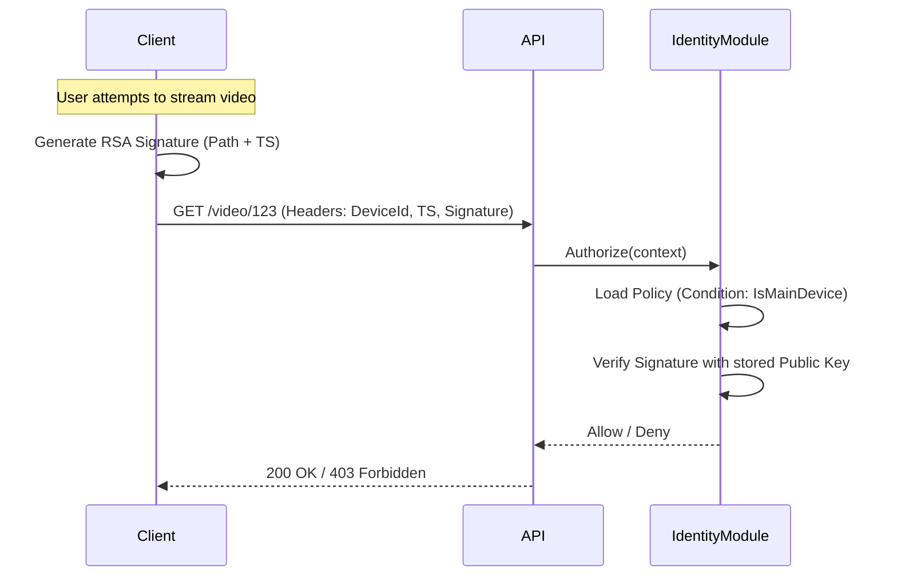

# Device-Aware Security & Signature Verification

In low-bandwidth and offline-first environments, account sharing and token theft are significant risks. AlphaZero mitigates this through **Context-Aware Device Enforcement**.

## The "Main Device" Concept

Every `TenantUser` can have multiple registered devices, but only one **Main Device**. 

- **Registration**: Devices are registered with their **RSA Public Key**.
- **Locking**: High-value content (like video streaming) can be locked to the "Main Device" via policy conditions.
- **Cooldown**: To prevent abuse, switching the Main Device has a mandatory **90-day cooldown** period.

## The `IsMainDevice` Operator

When a policy statement includes the `IsMainDevice` condition, the `ConditionEvaluator` performs a multi-step validation:

### 1. Device Match
It checks if the `X-Device-Id` header in the request matches the `MainDeviceId` stored for the user in the database.

### 2. Signature Verification
Simply matching the ID is not enough (IDs can be spoofed). The client must sign the request.
- **Data to Sign**: `{RequestPath}:{Timestamp}`
- **Algorithm**: RSA-SHA256
- **Headers**:
    - `X-Device-Id`: The UUID of the device.
    - `X-Timestamp`: Unix timestamp (seconds).
    - `X-Signature`: Base64 encoded RSA signature.

### 3. Replay Prevention
The `X-Timestamp` is checked against the server's current time. If the request is older than **5 minutes**, it is rejected. This prevents attackers from capturing a valid signed request and replaying it later.

---

## Technical Flow

## Security Rationale
By requiring a signature on every sensitive request, we ensure that:
1. The user possesses the **Private Key** (stored securely in the device's KeyStore/Keychain).
2. The token (`sub`) alone is not enough to access content.
3. Access is tied to the physical hardware registered by the user.
