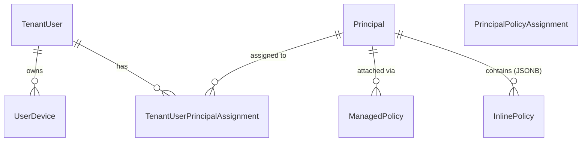

# Core Identity Entities

The AlphaZero Identity system is built on four primary entities that separate global identity, tenant membership, and contextual permissions.

## 1. TenantUser (The Anchor)
`TenantUser` represents a person within a specific academy (Tenant). It is the central link for all business logic (Enrollments, Progress, Payments).

- **IdentityId**: Links to the global Cognito `sub`.
- **MainDeviceId**: The ID of the device authorized for high-security actions (e.g., Video Streaming).
- **Devices**: A collection of registered devices with their respective RSA Public Keys.

## 2. Principal (The Security Subject)
A `Principal` is a generic subject that holds permissions. Principals can be **Users** or **Roles**.

- **Polymorphism**:
  - **IAM User**: A principal with a local `Username` and `PasswordHash`. Used for staff accounts or system bots.
  - **Role Principal**: A template (e.g., "Student", "Teacher") that holds a set of `ManagedPolicies`. It does *not* have a password; instead, it is assigned to `TenantUsers`.
- **Policies**: Every Principal owns a collection of `InlinePolicies` and `ManagedPolicies`.

## 3. TenantUserPrincipalAssignment (The Scope Glue)
This entity is the "magic" that makes the system scale. It assigns a **Principal** (usually a Role) to a **TenantUser** for a specific **Resource Scope**.

### Why Assignments?
Instead of creating a "Student in Math 101" role and a "Student in Science 202" role, we create one generic "Student" role principal (with no predefined scope). We then create two assignments:
1. `User Ali` + `Role Student` + `Resource: az:courses:T1:course/math-101`
2. `User Ali` + `Role Student` + `Resource: az:courses:T1:course/science-202`

During authorization, the `PolicyEvaluator` dynamically scopes the "Student" permissions to only the resource path specified in the assignment.

## 4. ManagedPolicy (The Template)
A global, reusable set of `PolicyStatements`. These are usually defined once and attached to multiple `Principals`.

---

## Entity Relationship Summary

