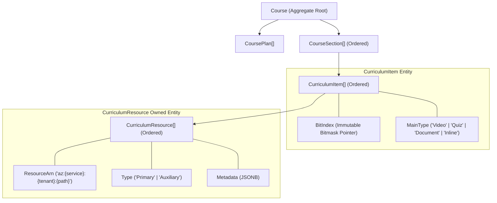

# 🪐 Course Module API Endpoints Problem: Legacy Binary Item Model vs. Multi-Resource Curriculum Design

## 1. Executive Summary & Core Architectural Conflict

The `Courses` bounded context in AlphaZero was originally designed around a rigid binary paradigm where a course section could only contain two distinct content types: a **Video Lesson** or an **Assessment (Quiz)**.

During subsequent domain-driven refactoring, the **Domain** and **Infrastructure (Persistence)** layers were upgraded to a modern, highly flexible **Curriculum Design** pattern:
- A [`Course`](file:///home/azero/Desktop/AlphaZeroLearningAcademy/src/alphazero-api/Modules/Courses/Domain/Aggregates/Courses/Course.cs) aggregate root owns a hierarchy of [`CourseSection`](file:///home/azero/Desktop/AlphaZeroLearningAcademy/src/alphazero-api/Modules/Courses/Domain/Aggregates/Courses/CourseSection.cs) entities.
- Each [`CourseSection`](file:///home/azero/Desktop/AlphaZeroLearningAcademy/src/alphazero-api/Modules/Courses/Domain/Aggregates/Courses/CourseSection.cs) contains an ordered collection of polymorphic [`CurriculumItem`](file:///home/azero/Desktop/AlphaZeroLearningAcademy/src/alphazero-api/Modules/Courses/Domain/Aggregates/Courses/CurriculumItem.cs) entities (`MainType`: `Video`, `Quiz`, `Document`, `Inline`, etc.).
- Each [`CurriculumItem`](file:///home/azero/Desktop/AlphaZeroLearningAcademy/src/alphazero-api/Modules/Courses/Domain/Aggregates/Courses/CurriculumItem.cs) can contain **multiple** ordered [`CurriculumResource`](file:///home/azero/Desktop/AlphaZeroLearningAcademy/src/alphazero-api/Modules/Courses/Domain/Aggregates/Courses/CurriculumResource.cs) records classified by role (`Primary` vs `Auxiliary`), backed by universal [`ResourceArn`](file:///home/azero/Desktop/AlphaZeroLearningAcademy/src/alphazero-api/AlphaZero.Shared/Domain/ResourceArn.cs) pointers and arbitrary JSONB metadata.

### The Conflict
While the Domain and PostgreSQL persistence layers fully support this **1 Section -> Many Items -> Many Resources** composition, the **Application layer** and **Presentation (FastEndpoints)** layers remain trapped in the legacy binary paradigm. 

Currently, content authoring is restricted to two legacy endpoints:
1. `POST /courses/{CourseId}/sections/{SectionId}/lessons` &rarr; [`AddLessonCommand`](file:///home/azero/Desktop/AlphaZeroLearningAcademy/src/alphazero-api/Modules/Courses/Application/Courses/Commands/AddLesson/AddLesson.cs)
2. `POST /courses/{CourseId}/sections/{SectionId}/assessments` &rarr; [`AddAssessmentCommand`](file:///home/azero/Desktop/AlphaZeroLearningAcademy/src/alphazero-api/Modules/Courses/Application/Courses/Commands/AddQuiz/AddQuiz.cs)

These endpoints strictly force an item to be **either a single video lesson OR a single assessment quiz**. They provide **zero capabilities** to attach auxiliary resources (e.g., lecture slides, PDF worksheets, reading guides, supplementary URLs), create non-video/non-quiz items (e.g., documents, inline rich text), link existing assessments without duplicating them, or manage resource lifecycles (reordering, updating, removing).

---

## 2. Deep-Dive: Current Domain Architecture

### 2.1 The Aggregate Hierarchy
The domain model residing in [`AlphaZero.Modules.Courses.Domain`](file:///home/azero/Desktop/AlphaZeroLearningAcademy/src/alphazero-api/Modules/Courses/Domain) establishes a clear hierarchy:



### 2.2 Domain Entities and Responsibilities

1. **[`Course`](file:///home/azero/Desktop/AlphaZeroLearningAcademy/src/alphazero-api/Modules/Courses/Domain/Aggregates/Courses/Course.cs#L9-L206):**
   - Manages state transitions (`Draft` &rarr; `UnderReview` &rarr; `Approved` &rarr; `Published`).
   - Allocates the monotonic, immutable [`NextAvailableBitIndex`](file:///home/azero/Desktop/AlphaZeroLearningAcademy/src/alphazero-api/Modules/Courses/Domain/Aggregates/Courses/Course.cs#L15) for every new curriculum item added.
   - Provides domain operations:
     - [`AddCurriculumItem(sectionId, title, mainType, primaryResourceArn, metadata)`](file:///home/azero/Desktop/AlphaZeroLearningAcademy/src/alphazero-api/Modules/Courses/Domain/Aggregates/Courses/Course.cs#L84-L95)
     - [`LinkResourceToItem(itemId, resourceArn, type, metadata)`](file:///home/azero/Desktop/AlphaZeroLearningAcademy/src/alphazero-api/Modules/Courses/Domain/Aggregates/Courses/Course.cs#L186-L192)
     - [`UpdateResourceMetadata(resourceId, metadata)`](file:///home/azero/Desktop/AlphaZeroLearningAcademy/src/alphazero-api/Modules/Courses/Domain/Aggregates/Courses/Course.cs#L194-L205)
     - [`ReorderItems(sectionId, itemIds)`](file:///home/azero/Desktop/AlphaZeroLearningAcademy/src/alphazero-api/Modules/Courses/Domain/Aggregates/Courses/Course.cs#L97-L107)

2. **[`CourseSection`](file:///home/azero/Desktop/AlphaZeroLearningAcademy/src/alphazero-api/Modules/Courses/Domain/Aggregates/Courses/CourseSection.cs#L7-L67):**
   - Represents a structural container (e.g., "Chapter 1: Fluid Dynamics").
   - Maintains an ordered list of `_items` ([`CurriculumItem`](file:///home/azero/Desktop/AlphaZeroLearningAcademy/src/alphazero-api/Modules/Courses/Domain/Aggregates/Courses/CurriculumItem.cs)).
   - Implements soft deletion (`Delete()`, `Restore()`, `ISoftDeletable`).

3. **[`CurriculumItem`](file:///home/azero/Desktop/AlphaZeroLearningAcademy/src/alphazero-api/Modules/Courses/Domain/Aggregates/Courses/CurriculumItem.cs#L8-L115):**
   - Represents a standalone instructional step/unit in the curriculum.
   - Holds the `BitIndex` required by the `VARBIT` progress tracking engine.
   - Contains `MainType` (validated against allowed service schemas).
   - Encapsulates a collection of `_resources` ([`CurriculumResource`](file:///home/azero/Desktop/AlphaZeroLearningAcademy/src/alphazero-api/Modules/Courses/Domain/Aggregates/Courses/CurriculumResource.cs)).
   - Provides domain operations:
     - [`AddResource(arn, type, metadata)`](file:///home/azero/Desktop/AlphaZeroLearningAcademy/src/alphazero-api/Modules/Courses/Domain/Aggregates/Courses/CurriculumItem.cs#L30-L53): Enforces tenant matching (BOLA security check) and verifies that for `Primary` resources, the `arn.Service` matches the `MainType`.
     - [`ReorderResources(orderedArns)`](file:///home/azero/Desktop/AlphaZeroLearningAcademy/src/alphazero-api/Modules/Courses/Domain/Aggregates/Courses/CurriculumItem.cs#L55-L79): Re-indexes the resource order within the item.

4. **[`CurriculumResource`](file:///home/azero/Desktop/AlphaZeroLearningAcademy/src/alphazero-api/Modules/Courses/Domain/Aggregates/Courses/CurriculumResource.cs#L6-L33):**
   - Contains the target [`ResourceArn`](file:///home/azero/Desktop/AlphaZeroLearningAcademy/src/alphazero-api/AlphaZero.Shared/Domain/ResourceArn.cs) (e.g. `az:video:tenant-1:video/uuid`, `az:document:tenant-1:document/uuid`, `az:assessment:tenant-1:assessment/uuid`).
   - Categorized as `Primary` (the core deliverable) or `Auxiliary` (supporting resources).
   - Holds polymorphic `JsonElement` metadata for client-side rendering (duration, URLs, thumbnail, passing scores, etc.).

---

## 3. Database Persistence & EF Core Mapping Analysis

The infrastructure configuration confirms that EF Core is already wired to store items and multi-resources:

### 3.1 [`CurriculumItemConfiguration.cs`](file:///home/azero/Desktop/AlphaZeroLearningAcademy/src/alphazero-api/Modules/Courses/Infrastructure/Persistance/Configurations/CurriculumItemConfiguration.cs)
```csharp
builder.ToTable("CurriculumItems", "Courses");
builder.HasKey(i => i.Id);

builder.Property(i => i.Title).IsRequired().HasMaxLength(256);
builder.Property(i => i.MainType).IsRequired().HasMaxLength(50);

// Owned Collection for Curriculum Resources
builder.OwnsMany(i => i.Resources, rb =>
{
    rb.ToTable("CurriculumResources", "Courses");
    rb.WithOwner().HasForeignKey("CurriculumItemId");
    rb.Property<Guid>("Id").ValueGeneratedOnAdd();
    rb.HasKey("Id");

    rb.Property(r => r.Arn)
        .HasConversion(
            arn => arn == null ? string.Empty : arn.Value,
            val => string.IsNullOrEmpty(val) ? null : ResourceArn.Create(val).Value)
        .IsRequired()
        .HasMaxLength(500);

    rb.Property(r => r.Type).IsRequired().HasMaxLength(50);
    rb.Property(r => r.Order).IsRequired();
    rb.Property(r => r.Metadata).HasColumnType("jsonb");
});
```

### 3.2 Existing Database Schema
The database already has:
- `Courses.CurriculumItems` table (columns: `Id`, `Title`, `MainType`, `BitIndex`, `Order`, `SectionId`, `TenantId`, `IsDeleted`, `OnDeleted`).
- `Courses.CurriculumResources` table (columns: `Id`, `CurriculumItemId`, `Arn`, `Type`, `Order`, `Metadata`).

---

## 4. The Core Problem: Architectural Gaps in Application & Endpoints

Despite the flexible domain and database schema, the **Application** and **Presentation** layers remain anchored to the old binary world:

### Problem 4.1: Rigid Bifurcation into "Lesson" vs "Quiz" Endpoints

The API layer only provides two content-insertion endpoints:

```
POST /courses/{CourseId}/sections/{SectionId}/lessons
POST /courses/{CourseId}/sections/{SectionId}/assessments
```

| Dimension | `AddLessonEndpoint` & [`AddLessonCommand`](file:///home/azero/Desktop/AlphaZeroLearningAcademy/src/alphazero-api/Modules/Courses/Application/Courses/Commands/AddLesson/AddLesson.cs) | `AddAssessmentEndpoint` & [`AddAssessmentCommand`](file:///home/azero/Desktop/AlphaZeroLearningAcademy/src/alphazero-api/Modules/Courses/Application/Courses/Commands/AddQuiz/AddQuiz.cs) |
| :--- | :--- | :--- |
| **Payload** | `{ title: string, videoId: Guid }` | `{ title: string, assessmentId: Guid, type: string, passingScore: decimal, description: string }` |
| **Hardcoded MainType** | `"Video"` | `"Quiz"` |
| **Resource Type Created** | Single `Primary` resource only | Single `Primary` resource only |
| **Supported Media** | Only videos registered in `VideoUploading` module | Only assessments in `Assessments` module |
| **Auxiliary Content** | ❌ Impossible | ❌ Impossible |

There is **no generic endpoint** such as `POST /courses/{courseId}/sections/{sectionId}/items` to create an item of arbitrary `MainType` with multiple primary and auxiliary resources.

---

### Problem 4.2: Inability to Represent Real-World Curriculum Units (The 1:1 Trap)

In contemporary online learning, a lesson is rarely a raw video in isolation:
- **Typical Lesson Structure:**
  - `Primary Resource`: High-definition video lecture (`az:video:...`).
  - `Auxiliary Resource 1`: Lecture notes PDF (`az:document:...`).
  - `Auxiliary Resource 2`: Cheat-sheet / Summary formula sheet (`az:document:...`).
  - `Auxiliary Resource 3`: Formative practice quiz (`az:assessment:...`).
- **Current Limitation:** Under the current API, an instructor must create 4 separate standalone items just to provide lecture notes and a practice quiz for a single lecture. This pollutes the course outline, skews progress tracking (`BitIndex`), and fragments the learner experience.

---

### Problem 4.3: Complete Absence of Resource Lifecycle Endpoints

While the Domain aggregate has methods for resource management, **no API endpoints or MediatR commands exist to invoke them**:
- ❌ **No Add Resource Endpoint:** Cannot attach an auxiliary resource to an existing item (`Course.LinkResourceToItem` is only reachable via the video consumer or an awkward `LessonId` override in `AddLessonCommand`).
- ❌ **No Remove Resource Endpoint:** Neither Domain, Application, nor Presentation has a way to remove a resource from an item (`RemoveResource` method is missing everywhere).
- ❌ **No Reorder Resources Endpoint:** `CurriculumItem.ReorderResources(List<ResourceArn>)` exists in domain, but has no command or endpoint.
- ❌ **No Resource Metadata Update Endpoint:** Client cannot update resource titles, captions, or file references once linked.

---

### Problem 4.4: The Assessment Duplication Anti-Pattern

In [`AddAssessmentEndpoint.cs`](file:///home/azero/Desktop/AlphaZeroLearningAcademy/src/alphazero-api/Modules/Courses/Presentation/Courses/AddItem/AddQuiz.cs#L58-L74):
```csharp
public override async Task HandleAsync(AddAssessmentRequest req, CancellationToken ct)
{
    var tenant = _tenantProvider.GetTenant();
    if (tenant == null) { ... }

    // BUG: req.AssessmentId is completely ignored!
    var command = new AddAssessmentCommand(
        req.CourseId, 
        req.SectionId, 
        req.Title, 
        new CreateAssessmentRequest(req.Title, req.Type, req.PassingScore, req.Description, (Guid)tenant));

    var result = await _module.Send(command, ct);
    ...
}
```
1. In the request body, the client supplies `AssessmentId` (expecting to link an existing quiz created in the Assessments authoring tool).
2. The endpoint **discards** `req.AssessmentId` and commands the handler to create a **brand-new assessment** in the Assessments module via MassTransit request/response (`IAssessmentService`).
3. Every time a quiz is attached or re-attached to a section, a redundant, duplicate record is spawned in the Assessments module database.
4. If a teacher creates an assessment library, they cannot link an existing assessment by ARN!

---

### Problem 4.5: Tight Coupling to External Service Handshakes During Authoring

In [`AddLessonCommandHandler.cs`](file:///home/azero/Desktop/AlphaZeroLearningAcademy/src/alphazero-api/Modules/Courses/Application/Courses/Commands/AddLesson/AddLesson.cs#L58-L88):
- If metadata is omitted, it executes an in-memory MassTransit RPC request to the `VideoUploading` module (`_videoRequestClient.GetResponse<VideoMetadataResponse, ...>`).
- If the video processing pipeline is delayed or the video is external/pre-signed, the command fails or falls back to an empty JSON element `{}`.
- Adding a curriculum item is coupled to concrete integration events rather than taking declarative resource descriptors.

---

### Problem 4.6: Critical Repository Bug — Aggregate Incomplete Graph Loading

In [`CourseRepository.cs`](file:///home/azero/Desktop/AlphaZeroLearningAcademy/src/alphazero-api/Modules/Courses/Infrastructure/Repositories/CourseRepository.cs#L15-L21):
```csharp
public async Task<Course?> GetByIdWithSectionsAsync(Guid id, CancellationToken cancellationToken = default)
{
    return await _context.Courses
        .Include(c => c.Sections)
            .ThenInclude(s => s.Items)
        .FirstOrDefaultAsync(c => c.Id == id, cancellationToken);
}
```
> [!CAUTION]
> Notice that `GetByIdWithSectionsAsync` does **NOT** include `.ThenInclude(i => i.Resources)`.
>
> When `AddLessonCommandHandler` receives a `LessonId` to link an existing resource via `course.LinkResourceToItem(...)`, the item's `_resources` collection is **empty** because EF Core never loaded it.
> Inside `CurriculumItem.AddResource`, `var order = _resources.Count;` evaluates to `0`, producing duplicate order indexes or corrupting EF Core's change tracker for owned entities!

Contrast this with `GetCourseAsync` in the same repository, which correctly includes `.ThenInclude(item => item.Resources)`.

---

### Problem 4.7: Frontend & Read Model Desynchronization

Inspection of the frontend architecture in [`UIDemo/AdminDemo/src/features/courses/CourseArchitect.tsx`](file:///home/azero/Desktop/AlphaZeroLearningAcademy/UIDemo/AdminDemo/src/features/courses/CourseArchitect.tsx) and [`types/index.ts`](file:///home/azero/Desktop/AlphaZeroLearningAcademy/UIDemo/AdminDemo/src/types/index.ts#L19-L27) reveals severe contract drift:

```typescript
// UIDemo frontend expects:
export interface CourseItem {
  id: string;
  title: string;
  type: 'Lesson' | 'Assessment';
  order: number;
  bitIndex: number;
  resourceId: string;            // <-- Flat scalar!
  metadata: Record<string, any>; // <-- Flat scalar!
}
```

However, [`GetCourseEndpoint.cs`](file:///home/azero/Desktop/AlphaZeroLearningAcademy/src/alphazero-api/Modules/Courses/Presentation/Courses/Get/GetCourse.cs#L28-L40) and [`CourseQueryService.cs`](file:///home/azero/Desktop/AlphaZeroLearningAcademy/src/alphazero-api/Modules/Courses/Infrastructure/Queries/CourseQueryService.cs#L37-L47) return:
```json
{
  "id": "...",
  "title": "Introduction",
  "type": "Video",
  "order": 0,
  "bitIndex": 0,
  "resources": [
    {
      "arn": "az:video:tenant-1:video/uuid",
      "type": "Primary",
      "order": 0,
      "metadata": { ... }
    }
  ]
}
```
- The frontend looks for `item.resourceId` &rarr; `undefined`!
- The frontend looks for `item.metadata` &rarr; `undefined`!
- The frontend checks `item.type === 'Lesson'` &rarr; `false` (because backend returns `"Video"` or `"Quiz"`).
- Result: Video previewing in `CourseArchitect.tsx` breaks, video streaming playback in `CourseViewer.tsx` fails, and status badges fail to render.

---

### Problem 4.8: Missing Item & Section CRUD Operations

As demonstrated in [`SoftDeleteTests.cs`](file:///home/azero/Desktop/AlphaZeroLearningAcademy/tests/Modules/Courses/Courses.Tests.Integration/SoftDeleteTests.cs#L48-L56):
```csharp
// (Assuming for now we don't have a public endpoint for DeleteSection yet, 
// we test the infrastructure's capability)
await ExecuteDbContextAsync(async db => { ... db.Remove(section!); ... });
```
There are currently:
- ❌ **No Delete Section endpoint** (`DELETE /courses/{courseId}/sections/{sectionId}`)
- ❌ **No Delete Item endpoint** (`DELETE /courses/{courseId}/items/{itemId}`)
- ❌ **No Update Section endpoint** (`PUT/PATCH /courses/{courseId}/sections/{sectionId}`)
- ❌ **No Update Item endpoint** (`PUT/PATCH /courses/{courseId}/items/{itemId}`)
- ❌ **No Move Item between Sections endpoint**

---

### Problem 4.9: Progress Tracking Invariants with Multi-Resource Items

In AlphaZero, student progress is stored in a PostgreSQL `VARBIT` column inside `Progress.Bitmask`:
- `BitIndex` is allocated monotonically per **Item**, **not per resource**.
- When an item has multiple resources (e.g. a Primary Video and an Auxiliary Quiz):
  - In [`AssessmentGradingCompletedConsumer.cs`](file:///home/azero/Desktop/AlphaZeroLearningAcademy/src/alphazero-api/Modules/Courses/Infrastructure/Consumers/Assessments/AssessmentGradingCompletedConsumer.cs#L38), passing an assessment triggers `courseRepository.GetItemBitIndexByResourceIdAsync(assessmentId)` and completes the item's bit.
  - If the item's primary content is a video that has not yet been watched, passing the auxiliary quiz prematurely marks the entire lesson complete!
  - There is currently no domain rule or policy specifying whether **only the Primary resource** completes the item bit, or if custom completion criteria apply.

---

## 5. Summary of Gaps Across Architectural Layers

| Capability | Domain Layer | Infrastructure Layer | Application Layer | Presentation / API Layer |
| :--- | :---: | :---: | :---: | :---: |
| **Multi-Resource Item Support** | ✅ Yes (`CurriculumItem.Resources`) | ✅ Yes (`Courses.CurriculumResources`) | ❌ No (Forced single video/quiz) | ❌ No (Forced `/lessons` & `/assessments`) |
| **Generic Item Creation** | ✅ Yes (`AddCurriculumItem`) | ✅ Yes | ❌ No | ❌ No |
| **Attach Auxiliary Resource** | ✅ Yes (`LinkResourceToItem`) | ⚠️ Broken (`Resources` not loaded) | ❌ Partial (Only hack via `AddLesson`) | ❌ No |
| **Remove Resource from Item** | ❌ Missing in Domain | ❌ No | ❌ No | ❌ No |
| **Reorder Resources within Item** | ✅ Yes (`ReorderResources`) | ✅ Yes | ❌ No | ❌ No |
| **Link Existing Assessment by ARN** | ✅ Yes (`ResourceArn.ForAssessment`) | ✅ Yes | ❌ No (Forces new creation) | ❌ No (Ignores `req.AssessmentId`) |
| **Support Document / Inline Types**| ✅ Yes (`MainType` validation) | ✅ Yes | ❌ No | ❌ No |
| **Delete / Soft-Delete Section** | ✅ Yes (`CourseSection.Delete()`) | ✅ Yes (`SoftDeleteInterceptor`) | ❌ No command | ❌ No endpoint |
| **Delete / Soft-Delete Item** | ✅ Yes (`CurriculumItem.Delete()`) | ✅ Yes (`SoftDeleteInterceptor`) | ❌ No command | ❌ No endpoint |
| **Update Section / Item Title** | ✅ Yes (`Update()`) | ✅ Yes | ❌ No command | ❌ No endpoint |

---

## 6. Utilizing Shared Tools & Frameworks (`AlphaZero.Shared`)

The solution must leverage the existing architectural building blocks available in [`AlphaZero.Shared`](file:///home/azero/Desktop/AlphaZeroLearningAcademy/src/alphazero-api/AlphaZero.Shared):

1. **[`ResourceArn`](file:///home/azero/Desktop/AlphaZeroLearningAcademy/src/alphazero-api/AlphaZero.Shared/Domain/ResourceArn.cs):**
   - Standard ARN syntax: `az:{service}:{tenantId}:{resourcePath}`.
   - Built-in helpers:
     - `ResourceArn.ForVideo(tenantId, videoId)`
     - `ResourceArn.ForAssessment(tenantId, assessmentId)`
     - `ResourceArn.ForDocument(tenantId, documentId)`
     - `ResourceArn.ForInlineResource(tenantId, inlineId)`
   - Used for fine-grained authorization and strict multi-tenant BOLA isolation checks (`CurriculumItem.AddResource` validates tenant boundaries).

2. **Access Control & RBAC (`AccessControl` Extension):**
   - FastEndpoints extension in [`DTOs.cs`](file:///home/azero/Desktop/AlphaZeroLearningAcademy/src/alphazero-api/AlphaZero.Shared/Authorization/DTOs.cs#L20-L62):
     ```csharp
     this.AccessControl("courses:Edit", (req, tenantId) => ResourceArn.ForCourse(tenantId, req.CourseId));
     ```
   - Automatically verified against caller claims and permissions in `IAMPreprocessor`.

3. **Unified Error Handling ([`ErrorExtension.cs`](file:///home/azero/Desktop/AlphaZeroLearningAcademy/src/alphazero-api/AlphaZero.Shared/Presentation/Extensions/Errors.cs)):**
   - Returns standard error response body:
     ```csharp
     if (result.IsError)
     {
         await this.SendErrorResponseAsync(result.Errors, ct);
         return;
     }
     ```
   - Formats `ErrorOr<T>` failures into standardized JSON with status codes, domain error codes, and property metadata.

4. **CQRS & Unit of Work:**
   - [`ICommand<T>`](file:///home/azero/Desktop/AlphaZeroLearningAcademy/src/alphazero-api/AlphaZero.Shared/Application/IModuleBus.cs) and [`IQuery<T>`](file:///home/azero/Desktop/AlphaZeroLearningAcademy/src/alphazero-api/AlphaZero.Shared/Application/IModuleBus.cs) via MediatR with automated transaction handling via [`UnitOfWorkDecoratorCommandHandler`](file:///home/azero/Desktop/AlphaZeroLearningAcademy/src/alphazero-api/AlphaZero.Shared/Application/UnitOfWorkDecoratorCommandHandler.cs).

---

## 7. Target Architecture & Recommended Solution Blueprint

To resolve this problem permanently while maintaining backward compatibility with current integration tests and the UI Demo, the following enhancements are recommended:

### 7.1 Domain Enhancements
1. Add `RemoveResource(ResourceArn arn)` to [`CurriculumItem`](file:///home/azero/Desktop/AlphaZeroLearningAcademy/src/alphazero-api/Modules/Courses/Domain/Aggregates/Courses/CurriculumItem.cs) and propagate it to [`Course`](file:///home/azero/Desktop/AlphaZeroLearningAcademy/src/alphazero-api/Modules/Courses/Domain/Aggregates/Courses/Course.cs).
2. Add `RemoveCurriculumItem(Guid itemId)` to [`CourseSection`](file:///home/azero/Desktop/AlphaZeroLearningAcademy/src/alphazero-api/Modules/Courses/Domain/Aggregates/Courses/CourseSection.cs) and [`Course`](file:///home/azero/Desktop/AlphaZeroLearningAcademy/src/alphazero-api/Modules/Courses/Domain/Aggregates/Courses/Course.cs).
3. Add `RemoveSection(Guid sectionId)` to [`Course`](file:///home/azero/Desktop/AlphaZeroLearningAcademy/src/alphazero-api/Modules/Courses/Domain/Aggregates/Courses/Course.cs).
4. Update `CurriculumItem.AddResource` to guard against multiple `Primary` resources unless explicitly replacing.

### 7.2 Infrastructure Fixes
1. Fix [`CourseRepository.GetByIdWithSectionsAsync`](file:///home/azero/Desktop/AlphaZeroLearningAcademy/src/alphazero-api/Modules/Courses/Infrastructure/Repositories/CourseRepository.cs#L15-L21) to include:
   ```csharp
   .Include(c => c.Sections)
       .ThenInclude(s => s.Items)
           .ThenInclude(i => i.Resources)
   ```
2. Unify repository methods to avoid graph-loading inconsistencies.

### 7.3 New Unified Curriculum Endpoints (Application & Presentation)
Introduce first-class REST endpoints for curriculum orchestration:

1. **Create Curriculum Item (Generic & Multi-Resource):**
   - `POST /courses/{courseId}/sections/{sectionId}/items`
   - Payload:
     ```json
     {
       "title": "Thermodynamics Fundamentals",
       "mainType": "Video",
       "primaryResource": {
         "arn": "az:video:tenant-1:video/b2c...",
         "metadata": { "duration": "00:15:30", "thumbnailUrl": "..." }
       },
       "auxiliaryResources": [
         {
           "arn": "az:document:tenant-1:document/c8d...",
           "metadata": { "title": "Formula Sheet.pdf", "sizeBytes": 102400 }
         }
       ]
     }
     ```

2. **Resource Management Under an Item:**
   - `POST /courses/{courseId}/items/{itemId}/resources`: Attach an auxiliary resource (e.g., attach a document, quiz, or link to an item).
   - `DELETE /courses/{courseId}/items/{itemId}/resources/{resourceArn}`: Detach/remove a resource.
   - `PUT /courses/{courseId}/items/{itemId}/resources/reorder`: Reorder resources within an item.

3. **Section & Item Full Lifecycle Management:**
   - `DELETE /courses/{courseId}/sections/{sectionId}`: Soft-delete section.
   - `PATCH /courses/{courseId}/sections/{sectionId}`: Update section title / order.
   - `DELETE /courses/{courseId}/items/{itemId}`: Soft-delete item.
   - `PATCH /courses/{courseId}/items/{itemId}`: Update item title / type.

4. **Backward Compatibility Facade:**
   - Keep `POST /courses/{courseId}/sections/{sectionId}/lessons` and `POST /courses/{courseId}/sections/{sectionId}/assessments` as thin wrappers around the new unified `AddCurriculumItemCommand`.
   - In `AddAssessmentEndpoint`, check if `req.AssessmentId` is provided; if so, link it directly via `ResourceArn.ForAssessment(tenantId, req.AssessmentId)` without creating a duplicate in the Assessments module.

5. **Read Model & Query Optimization:**
   - Enrich `ItemDto` and `ItemResponse` in `GetCourse` so that clients receive both:
     - The complete `Resources: List<ResourceResponse>` array (the true domain structure).
     - Convenient flattened getters/properties: `PrimaryResourceId`, `PrimaryResourceType`, `Metadata` (for seamless backward compatibility with `CourseArchitect.tsx` and mobile clients).