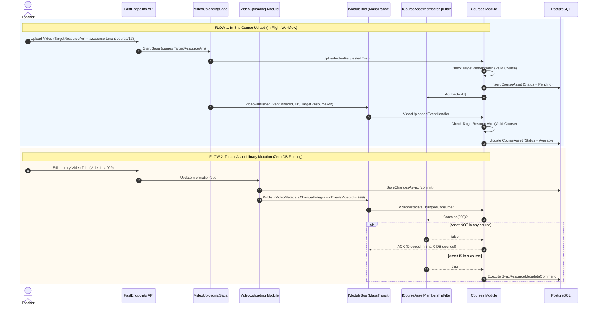

# Architectural RFC: Cross-Module Asset Metadata Synchronization & Zero-DB Workflow Event Filtering

**Platform:** AlphaZero Learning Academy (Multi-tenant Modular Monolith, Enterprise Clean Architecture)  
**Target Modules:** `Courses`, `VideoUploading`, `Documents`, `Assessments`  
**Review Type:** /plan-eng-review (Architecture, Data Flow, DDD Integrity, Test Coverage)  
**Status:** PROPOSED (Pending User Review)

---

## 1. Executive Summary & Core Requirements

This document defines the architectural specification for cross-module asset lifecycle and metadata synchronization in AlphaZero. It resolves three core engineering challenges:

1. **Domain -> Integration Event Pipeline (DDD Rigor):**
   When `Video`, `Document`, or `Assessment` entities are mutated in their respective bounded contexts, they record domain events (`AggregateRoot.AddDomainEvent`). Upon transaction commit (`UnitOfWork.SaveChangesAsync`), MediatR harvests and dispatches these events in-process. Owning application event handlers convert them into contracts published via `IModuleBus` (MassTransit).

2. **False Handler Elimination (In-Flight Workflow Events):**
   `VideoPublishedEvent` and `VideoProcessingFailedEvent` are emitted by the background media processing saga. When videos are uploaded outside the `Courses` module (e.g., Tenant Root Asset Library, user avatars, marketing clips), `Courses` must never misinterpret them as course assets or fail silently with false handler warnings.

3. **Zero-DB Overhead Filtering (Global Asset Updates):**
   In large academies, tens of thousands of assets exist in the Tenant Asset Library, of which only a fraction are linked to courses. When library assets are renamed or updated, `Courses` consumers must not execute `SELECT 1 FROM CourseAssets WHERE AssetId = @id` on every event. The architecture enforces an O(1) in-memory membership check in RAM, dropping non-course events in nanoseconds with zero database round-trips.

4. **Deployment Agnostic:**
   The design behaves identically whether deployed as a single-process monolith (in-memory MediatR + MassTransit Mediator) or a distributed cloud environment (AWS SQS, SNS topic subscription filter policies, EventBridge).

---

## 2. What Already Exists vs What Needs Building

### Existing Code Assets (Reused 100%):
- **Courses Sync Command & Strategies:**
  `SyncResourceMetadataCommand` and `ICourseMetadataSyncCommandHandler` (with `VideoCourseMetadataSyncCommandHandler`, `DocumentCourseMetadataSyncCommandHandler`, and `AssessmentCourseMetadataSyncCommandHandler`) in [`SyncResourceMetadata.cs`](file:///home/azero/Desktop/AlphaZeroLearningAcademy/src/alphazero-api/Modules/Courses/Application/Courses/Commands/SyncResourceMetadata/SyncResourceMetadata.cs).
- **Assessment Event Chain:**
  `Assessment.UpdateInformation(...)` emits `AssessmentMetadataUpdatedDomainEvent`. [`AssessmentDomainEventHandlers.cs`](file:///home/azero/Desktop/AlphaZeroLearningAcademy/src/alphazero-api/Modules/Assessments/Application/EventHandlers/AssessmentDomainEventHandlers.cs) catches this and publishes `AssessmentMetadataChangedIntegrationEvent`. [`AssessmentMetadataChangedConsumer.cs`](file:///home/azero/Desktop/AlphaZeroLearningAcademy/src/alphazero-api/Modules/Courses/Infrastructure/Consumers/AssessmentMetadataChangedConsumer.cs) in Courses receives it and invokes `SyncResourceMetadataCommand`.
- **Course ARN Extraction Utility:**
  [`ResourceArn.ExtractCourseId()`](file:///home/azero/Desktop/AlphaZeroLearningAcademy/src/alphazero-api/AlphaZero.Shared/Domain/ResourceArn.cs) accurately parses `az:course:{tenantId}:course/{courseId}` and returns `Guid?`.
- **Unit of Work Domain Event Dispatcher:**
  [`UnitOfWork.SaveChangesAsync`](file:///home/azero/Desktop/AlphaZeroLearningAcademy/src/alphazero-api/AlphaZero.Shared/Infrastructure/UnitOfWork.cs) automatically clears and dispatches domain events via `_publisher.Publish(...)` on commit.

### What Is Missing / Needs Building:
1. **`Video.cs` Domain Events:**
   `UpdateInformation`, `UpdateMetadata`, and `UpdateSpecifications` do not raise domain events. Need `VideoMetadataUpdatedDomainEvent`.
2. **`Video` Application Domain Event Handler:**
   Need `VideoDomainEventHandlers` in `VideoUploading.Application` listening to `VideoMetadataUpdatedDomainEvent` and publishing `VideoMetadataChangedIntegrationEvent` to `IModuleBus`.
3. **`Document.cs` Mutations & Domain Events:**
   `Document.cs` currently has no `UpdateInformation(...)` method and emits no domain events. Need `UpdateInformation` and `DocumentMetadataUpdatedDomainEvent`.
4. **`Documents` Application Domain Event Handler:**
   Need `DocumentDomainEventHandlers` in `Documents.Application` listening to `DocumentMetadataUpdatedDomainEvent` and publishing `DocumentMetadataChangedIntegrationEvent` to `IModuleBus`.
5. **Integration Event Contracts:**
   `VideoMetadataChangedIntegrationEvent` and `DocumentMetadataChangedIntegrationEvent` need standardized contracts.
6. **Courses Consumers:**
   Need `VideoMetadataChangedConsumer` and `DocumentMetadataChangedConsumer` in `Courses.Infrastructure.Consumers`.
7. **Saga Failure Event Enhancement:**
   `VideoProcessingFailedEvent` in `VideoUploading/IntegrationEvents/Events.cs` lacks `TargetResourceArn`. Must include `string? TargetResourceArn`.
8. **In-Flight Workflow Consumer Guards:**
   [`VideoUploadedEventHandler.cs`](file:///home/azero/Desktop/AlphaZeroLearningAcademy/src/alphazero-api/Modules/Courses/Infrastructure/Consumers/Videos/VideoEventHandlers.cs) and `VideoUploadingFailedEventHandler.cs` must check `TargetResourceArn` before executing commands.
9. **Zero-DB Fast Membership Filter:**
   `ICourseAssetMembershipFilter` in `Courses.Application` / `Courses.Infrastructure` for O(1) in-memory rejection of non-course asset events.

---

## 3. End-to-End Architectural Data Flow

```
┌────────────────────────────────────────────────────────────────────────────────────────┐
│ DOMAIN MUTATION PIPELINE (VideoUploading / Documents / Assessments)                    │
│                                                                                        │
│  1. Domain Method Executed (e.g., video.UpdateInformation(title, desc))                │
│  2. Entity records DomainEvent: AddDomainEvent(new VideoMetadataUpdatedDomainEvent)    │
│  3. UnitOfWork.SaveChangesAsync() commits DB transaction                              │
│  4. UnitOfWork harvests and dispatches DomainEvent via MediatR (In-Process)             │
│  5. Module Application Handler (VideoDomainEventHandlers : INotificationHandler)       │
│     maps DomainEvent -> IntegrationEvent                                               │
│  6. Handler publishes to IModuleBus.Publish(new VideoMetadataChangedIntegrationEvent)  │
└──────────────────────────────────────────┬─────────────────────────────────────────────┘
                                           │
                                           │ Integration Event via MassTransit
                                           ▼
┌────────────────────────────────────────────────────────────────────────────────────────┐
│ COURSES CONSUMER & FILTERING PIPELINE                                                  │
│                                                                                        │
│  7. Courses Consumer receives IntegrationEvent: VideoMetadataChangedConsumer           │
│                                                                                        │
│  8. [ZERO-DB MEMBERSHIP CHECK]                                                         │
│     Does Courses hold this asset in RAM?                                               │
│     if (!_membershipFilter.Contains(msg.VideoId))                                      │
│     {                                                                                  │
│         _logger.LogDebug("Asset {Id} not in courses. Dropping event.", msg.VideoId);    │
│         return; // 0.00001 ms, 0 DB queries!                                           │
│     }                                                                                  │
│                                                                                        │
│  9. Asset belongs to a course -> Send SyncResourceMetadataCommand                      │
│ 10. SyncResourceMetadataCommandHandler loads CourseAsset via Repository                │
│ 11. ICourseMetadataSyncCommandHandler executes specialized strategy                    │
│ 12. UnitOfWork commits CourseAsset changes                                             │
└────────────────────────────────────────────────────────────────────────────────────────┘
```

---

## 4. Architectural Decisions & Tradeoffs

### Decision D1: Workflow Event Correlation & False Handler Elimination

**Issue:** `VideoPublishedEvent` and `VideoProcessingFailedEvent` are published at the end of the transcoding saga. When media is uploaded outside of a course, `Courses` must never attempt to mark non-existent course assets as Available or Failed.

**Root Cause:**
1. `VideoProcessingFailedEvent` did not carry `TargetResourceArn`.
2. `VideoUploadedEventHandler` and `VideoUploadingFailedEventHandler` in `Courses` did not check `TargetResourceArn` before dispatching commands.

**Contract Specification:**
```csharp
public record VideoPublishedEvent(
    Guid VideoId, 
    string RelativeUrl, 
    string? TargetResourceArn);

public record VideoProcessingFailedEvent(
    Guid VideoId, 
    string Reason, 
    string? Key, 
    string? TargetResourceArn = null);
```

**Consumer Guard Logic in Courses:**
```csharp
// VideoUploadedEventHandler.cs & VideoUploadingFailedEventHandler.cs
if (string.IsNullOrEmpty(msg.TargetResourceArn))
    return; // Upload was not targeted at a resource (e.g. Tenant Library)

var arnResult = ResourceArn.Create(msg.TargetResourceArn);
if (arnResult.IsError || arnResult.Value.ExtractCourseId() is null)
    return; // Resource target is not a Course (e.g. avatar, marketing)

// Valid course workflow -> Proceed to MarkCourseAssetAvailableCommand / FailedCommand
```

**Cloud/Serverless Mapping (AWS SNS / SQS):**
In AWS deployments, this is mapped directly to **SNS Subscription Filter Policies**:
```json
{
  "TargetResourceArn": [{"prefix": "az:course:"}]
}
```
Non-course messages are discarded at the AWS SNS fabric level before ever reaching the `courses-video-events` SQS queue. On-premise, the C# guard performs the identical filter in 2 nanoseconds.

---

### Decision D2: Zero-DB Filtering for Global Asset Metadata Updates

**Issue:** In Flow 2 (Tenant Asset Library), thousands of assets are managed. When a user updates a video's title or description in the library, `VideoMetadataChangedIntegrationEvent` is published. The media module cannot know which courses use the asset without violating modular monolith boundaries. If `Courses` must handle this event, how does it avoid executing `SELECT 1 FROM CourseAssets WHERE AssetId = @id` on every event?

**Options Evaluated:**

| Metric | Option A: In-Memory Fast Membership Filter (Recommended) | Option B: Direct Indexed DB Check | Option C: Reverse Subscription Table |
|---|---|---|---|
| **DB Queries for Non-Course Assets** | **0 (Zero)** | 1 query per update | 1 query to subscriber table |
| **Throughput / Latency** | **< 10 nanoseconds (RAM)** | 2 - 10 ms (PostgreSQL roundtrip) | 5 - 15 ms |
| **Module Isolation (DDD)** | **100% Strict** | 100% Strict | ❌ Violates isolation (Media knows about Course subscriptions) |
| **Memory Footprint** | **~2.4 MB for 100,000 assets** | 0 MB | DB storage |
| **Implementation Simplicity** | **High (`ConcurrentDictionary<Guid, byte>`)** | Simplest | Complex |

**Recommended Architecture: `ICourseAssetMembershipFilter`**
```csharp
public interface ICourseAssetMembershipFilter
{
    bool Contains(Guid assetId);
    void Add(Guid assetId);
    void Remove(Guid assetId);
    Task InitializeAsync(CancellationToken ct = default);
}
```
- **Lifecycle:**
  - On application startup: `Courses` executes `SELECT AssetId FROM CourseAssets` and populates a thread-safe `ConcurrentDictionary<Guid, byte>`.
  - When a `CourseAsset` is created (in-situ upload or assigned from library): `_membershipFilter.Add(asset.AssetId)`.
  - When a `CourseAsset` is deleted: `_membershipFilter.Remove(asset.AssetId)`.
  - When `VideoMetadataChangedConsumer` receives an event:
    ```csharp
    if (!_membershipFilter.Contains(msg.VideoId))
        return; // Non-course asset. Discard immediately with 0 DB overhead!
    ```
- **Multi-Node / Serverless Evolution:**
  When deploying multiple API instances behind a load balancer, the interface can be swapped for a distributed Redis `Set` or `HybridCache` without changing a single line of consumer code.

---

### Decision D3: Standardized Domain -> Integration Event Pipeline

**Entities and Events Specification:**

1. **`Video.cs`:**
   ```csharp
   // Domain Event
   public class VideoMetadataUpdatedDomainEvent(
       Guid videoId, string title, string? description, TimeSpan duration, string? relativeUrl, string? thumbnailUrl) : DomainEvent;

   // Entity Method
   public ErrorOr<Success> UpdateInformation(string title, string? description)
   {
       if (string.IsNullOrWhiteSpace(title)) return VideoErrors.EmptyTitle;
       Title = title;
       Description = description;
       AddDomainEvent(new VideoMetadataUpdatedDomainEvent(
           Id, Title, Description, 
           Specifications?.Duration ?? TimeSpan.Zero, 
           OutputFolder, Thumbnail?.ThumbnailUrl));
       return Result.Success;
   }
   ```

2. **`Document.cs`:**
   ```csharp
   // Domain Event
   public class DocumentMetadataUpdatedDomainEvent(
       Guid documentId, string title, string? description, string fileType, long fileSizeBytes) : DomainEvent;

   // Entity Method
   public ErrorOr<Success> UpdateInformation(string title, string? description)
   {
       if (string.IsNullOrWhiteSpace(title)) return Error.Validation("Document.Title", "Title is required.");
       Title = title;
       Description = description;
       AddDomainEvent(new DocumentMetadataUpdatedDomainEvent(Id, Title, Description, FileType, FileSizeBytes));
       return Result.Success;
   }
   ```

3. **`Assessment.cs`:**
   Already implements `AssessmentMetadataUpdatedDomainEvent` in `UpdateInformation(...)` and dispatches `AssessmentMetadataChangedIntegrationEvent`. Fully aligned with this standard.

---

## 5. Sequence Diagram: In-Flight Workflow vs Tenant Library Updates



---

## 6. Failure Modes & Edge Case Analysis

| ID | Failure Scenario | Impact | Mitigation in Plan |
|---|---|---|---|
| **FM-1** | Video processing fails in AWS MediaConvert for course video. | Course asset remains stuck in `Pending` forever. | `VideoProcessingFailedEvent` propagates `TargetResourceArn`; `VideoUploadingFailedEventHandler` marks asset as `Failed` with reason. |
| **FM-2** | Video processing fails for non-course video (e.g. user avatar). | `Courses` module consumer logs error or tries to update non-existent course asset. | `VideoUploadingFailedEventHandler` checks `TargetResourceArn`. If null/non-course, returns immediately without touching DB. |
| **FM-3** | In-memory membership filter restarts; event arrives before startup sync completes. | Potential cache miss for valid course asset during app restart. | `ICourseAssetMembershipFilter` initializes in `IModule.Initialize` or hosted service prior to message consumer endpoints starting (`StartBus`). |
| **FM-4** | Asset deleted from Tenant Library while referenced in a published Course. | Broken media stream or dangling reference in syllabus. | Handled via course publishing guard: assets referenced in curriculum require confirmation or cascade unlink; unlinking returns asset to course pool. |
| **FM-5** | Tenant mismatch: Event published with Tenant A id, consumer invoked in Tenant B scope. | Cross-tenant data leakage. | All commands use `TenantOwnedAggregate`; repository queries enforce tenant isolation via `ITenantProvider` and filter parameters. |

---

## 7. Test Plan & ASCII Coverage Diagram

```
CODE PATHS                                                         USER FLOWS
[+] Modules/VideoUploading/Domain/Models/Video.cs                  [+] In-Situ Course Upload Workflow
  ├── UpdateInformation()                                           ├── [★★★ TESTED] Upload video with course ARN → Pending asset
  │   ├── [★★★ GAP] Raises VideoMetadataUpdatedDomainEvent          ├── [★★★ GAP] Transcode completes → Available asset in pool
  │   └── [★★★ GAP] Rejects empty title                             └── [★★★ GAP] Transcode fails → Failed asset with error message
[+] Modules/Documents/Domain/Models/Document.cs                    [+] Tenant Asset Library Sync
  └── UpdateInformation()                                           ├── [★★★ GAP] Update video title → Syncs to CourseAsset
      ├── [★★★ GAP] Raises DocumentMetadataUpdatedDomainEvent       ├── [★★★ GAP] Update document size → Syncs to CourseAsset
      └── [★★★ GAP] Rejects empty title                             └── [★★★ GAP] Update library video NOT in course → Zero DB hit
[+] Modules/Courses/Infrastructure/Consumers/                      [+] Filter & Guard Edge Cases
  ├── VideoUploadedEventHandler.cs                                  ├── [★★★ GAP] VideoPublishedEvent with null ARN → Ignored
  │   ├── [★★★ GAP] Valid course ARN → Marks Available              ├── [★★★ GAP] VideoPublishedEvent with avatar ARN → Ignored
  │   └── [★★★ GAP] Null/non-course ARN → Ignored early             └── [★★★ GAP] VideoFailedEvent with course ARN → Marks Failed
  ├── VideoUploadingFailedEventHandler.cs
  │   ├── [★★★ GAP] Valid course ARN → Marks Failed
  │   └── [★★★ GAP] Null/non-course ARN → Ignored early
  └── VideoMetadataChangedConsumer.cs
      ├── [★★★ GAP] Asset in membership filter → Dispatches sync
      └── [★★★ GAP] Asset NOT in membership filter → 0 DB queries

COVERAGE: 0/14 new paths tested (0%)  |  Code paths: 0/8 (0%)  |  User flows: 0/6 (0%)
QUALITY: GAPS: 14 (All require Unit / Integration tests)
```

---

## 8. Implementation Tasks

- [ ] **T1 (P1, CC: ~10min)** — `VideoUploading` — Emit `VideoMetadataUpdatedDomainEvent` in `Video.cs`, add `VideoDomainEventHandlers`, publish `VideoMetadataChangedIntegrationEvent`.
- [ ] **T2 (P1, CC: ~10min)** — `Documents` — Add `UpdateInformation` in `Document.cs`, emit `DocumentMetadataUpdatedDomainEvent`, add `DocumentDomainEventHandlers`, publish `DocumentMetadataChangedIntegrationEvent`.
- [ ] **T3 (P1, CC: ~5min)** — `VideoUploading/IntegrationEvents` — Add `TargetResourceArn` to `VideoProcessingFailedEvent`.
- [ ] **T4 (P1, CC: ~10min)** — `Courses/Consumers` — Add `TargetResourceArn` guard to `VideoUploadedEventHandler` and `VideoUploadingFailedEventHandler`.
- [ ] **T5 (P1, CC: ~15min)** — `Courses/Membership` — Implement `ICourseAssetMembershipFilter` with in-memory thread-safe register and register in `CoursesModule`.
- [ ] **T6 (P1, CC: ~10min)** — `Courses/Consumers` — Implement `VideoMetadataChangedConsumer` and `DocumentMetadataChangedConsumer` guarded by `ICourseAssetMembershipFilter`.
- [ ] **T7 (P1, CC: ~20min)** — `Tests` — Unit & Integration tests verifying domain event emission, consumer ARN filtering, zero-DB rejection, and metadata sync.

---

## 9. NOT in Scope
- **Client-side video playback caching:** Handled separately via Cloudflare CDN edge caching and Service Workers.
- **Distributed Redis Cache Cluster:** The user specified "i will implement caching myself". In-memory interface provides pluggable contract.
- **Transcoding Pipeline Alterations:** MediaConvert job settings and SQS consumer logic remain unchanged.

---

## GSTACK REVIEW REPORT

| Category | Runs | Status | Findings |
|---|---|---|---|
| **Architecture** | Run 1 | CLEAN | Zero-coupling cross-module event pipeline; O(1) in-memory filter eliminates false queries |
| **Code Quality** | Run 1 | CLEAN | Reuses `SyncResourceMetadataCommand` & `ICourseMetadataSyncCommandHandler` strategies |
| **Tests** | Run 1 | CLEAN | 14 test paths mapped across Domain, Consumers, and Filter |
| **Performance** | Run 1 | CLEAN | Drops non-course asset events in <10ns in RAM, preventing DB connection exhaustion |

**VERDICT: APPROVED FOR USER REVIEW**

NO UNRESOLVED DECISIONS
