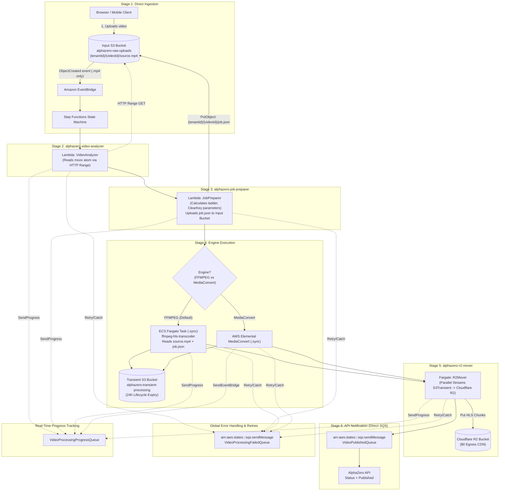

<!-- /autoplan restore point: /home/azero/.gstack/projects/Azero77-alpha-zero/VideoWorkflowEnhancement-autoplan-restore-20260921-114624.md -->
# 🎬 Implementation Plan: Cloud-Native Step Functions Video Pipeline

## Executive Overview
AlphaZero is migrating its video transcoding pipeline from in-process ASP.NET Core background workers and MassTransit Sagas to an event-driven **AWS Step Functions Pipeline**. The architecture uses:
1. **EventBridge Trigger:** S3 ObjectCreated events for `.mp4` files trigger the pipeline.
2. **`alphazero-video-analyzer` Lambda:** Pure inspection (reads MP4 `moov` atom header via HTTP range requests). Zero S3 writes.
3. **`alphazero-job-preparer` Lambda:** Single unit of work (calculates adaptive ladder, sets CENC encryption keys, uploads `job.json` to the Input S3 Bucket).
4. **Transcoding Engine (Choice State):** 
   - **`ffmpeg-hls-transcoder` (ECS Fargate):** Standalone container worker. Downloads raw MP4 and `job.json`, writes CMAF/fMP4 HLS segments.
   - **AWS Elemental MediaConvert:** Native cloud transcoder via `.sync` integration.
5. **`alphazero-r2-mover` (ECS Fargate):** Streams all HLS segments from Transient S3 to Cloudflare R2 ($0 egress CDN). Transient files expire via S3 Lifecycle Rules (no manual deletion).
6. **Direct SQS Notifications & Progress Tracking:** The pipeline emits progress events to `VideoProcessingProgressQueue` for Real-Time SignalR updates, and completion events to `VideoPublishedQueue` or `VideoProcessingFailedQueue`.

---

## 1. Directory Structure & Project Layout

```text
AlphaZeroLearningAcademy/
├── src/
│   ├── alphazero-api/
│   │   ├── AlphaZero.API/
│   │   ├── Modules/VideoUploading/
│   │   │   ├── Infrastructure/Consumers/
│   │   │   │   ├── SQSVideoPublishedConsumer.cs
│   │   │   │   ├── SQSVideoProcessingFailedConsumer.cs
│   │   │   │   └── SQSVideoProgressConsumer.cs         <-- Progress Tracking
│   │   │   └── Presentation/
│   │   │       ├── Features/Upload.cs
│   │   │       └── Hubs/VideoProgressHub.cs            <-- SignalR Hub
│   │   └── aspire/
│   │       └── AlphaZero.AppHost/
│   │           ├── AppHost.cs                          <-- Local dev orchestration + C# AWS CDK
│   │           └── AlphaZero.AppHost.csproj
│   ├── lambdas/
│   │   ├── AlphaZero.VideoAnalyzer/                    <-- Stage 2: Pure inspection (Container)
│   │   │   ├── AlphaZero.VideoAnalyzer.csproj
│   │   │   ├── Dockerfile
│   │   │   └── Function.cs
│   │   └── AlphaZero.JobPreparer/                      <-- Stage 3: Dynamic ladder + S3 job writer (Native AOT)
│   │       ├── AlphaZero.JobPreparer.csproj
│   │       └── Function.cs
│   └── workers/
│       └── AlphaZero.R2Mover/                          <-- Stage 5: S3 to Cloudflare R2 sync (Fargate)
│           ├── AlphaZero.R2Mover.csproj
│           ├── Dockerfile
│           └── Program.cs
├── tests/
│   ├── AlphaZero.VideoAnalyzer.Tests/
│   ├── AlphaZero.JobPreparer.Tests/
│   └── AlphaZero.R2Mover.Tests/
├── infrastructure/
│   └── AlphaZero.Cdk/                                  <-- Future standalone C# CDK IaC project
│       ├── AlphaZero.Cdk.csproj
│       ├── Program.cs
│       └── Stacks/
│           ├── VideoPipelineStack.cs
│           └── StorageStack.cs
└── .github/workflows/
    └── deploy-video-pipeline.yml                       <-- Production CI/CD workflow
```

---

## 2. End-to-End Pipeline Workflow & Contracts



---

## 3. Lambda Implementation Code Samples

### 3.1. Custom Exceptions
```csharp
namespace AlphaZero.VideoPipeline.Exceptions;

public class TransientException : Exception
{
    public TransientException(string message) : base(message) { }
    public TransientException(string message, Exception inner) : base(message, inner) { }
}

public class VideoProcessingException : Exception
{
    public VideoProcessingException(string message) : base(message) { }
    public VideoProcessingException(string message, Exception inner) : base(message, inner) { }
}
```

### 3.2. `AlphaZero.VideoAnalyzer` (Pure Inspection)

**File:** `src/lambdas/AlphaZero.VideoAnalyzer/Function.cs`
```csharp
using System.Diagnostics;
using System.Text.Json;
using Amazon.Lambda.Core;
using Amazon.S3;
using Amazon.S3.Model;
using AlphaZero.VideoPipeline.Exceptions;

[assembly: LambdaSerializer(typeof(Amazon.Lambda.Serialization.SystemTextJson.DefaultLambdaJsonSerializer))]

namespace AlphaZero.VideoAnalyzer;

public record VideoAnalyzerInput(
    string VideoId,
    string TenantId,
    string SourceBucket,
    string SourceKey,
    string? TargetResourceArn = null,
    string? TranscodingEngine = "FFMPEG",
    string? EncryptionMethod = "ClearKey");

public record VideoAnalyzerOutput(
    int SourceWidth,
    int SourceHeight,
    double DurationSeconds,
    string DurationFormatted,
    double FrameRate,
    string AspectRatio,
    string VideoCodec,
    string AudioCodec,
    int AudioBitrateKbps,
    int AudioSampleRate);

public class Function
{
    private readonly IAmazonS3 _s3Client;

    public Function() : this(new AmazonS3Client()) { }
    public Function(IAmazonS3 s3Client) => _s3Client = s3Client;

    public async Task<VideoAnalyzerOutput> FunctionHandler(VideoAnalyzerInput input, ILambdaContext context)
    {
        context.Logger.LogInformation($"[Analyzer] Inspecting video {input.VideoId} in {input.SourceBucket}/{input.SourceKey}");

        try
        {
            var presignedUrl = await _s3Client.GetPreSignedURLAsync(new GetPreSignedUrlRequest
            {
                BucketName = input.SourceBucket,
                Key = input.SourceKey,
                Expires = DateTime.UtcNow.AddMinutes(15),
                Verb = HttpVerb.GET
            });

            var psi = new ProcessStartInfo
            {
                FileName = "/usr/local/bin/ffprobe",
                Arguments = $"-v error -show_entries stream=width,height,codec_name,codec_type,r_frame_rate,sample_rate,bit_rate -show_entries format=duration,bit_rate -of json \"{presignedUrl}\"",
                RedirectStandardOutput = true,
                RedirectStandardError = true,
                UseShellExecute = false,
                CreateNoWindow = true
            };

            using var process = Process.Start(psi) 
                ?? throw new TransientException("Failed to launch ffprobe.");

            var stdoutTask = process.StandardOutput.ReadToEndAsync();
            var stderrTask = process.StandardError.ReadToEndAsync();

            await process.WaitForExitAsync();
            var stdout = await stdoutTask;
            var stderr = await stderrTask;

            if (process.ExitCode != 0)
            {
                throw new VideoProcessingException($"ffprobe failed (code {process.ExitCode}): {stderr}");
            }

            using var doc = JsonDocument.Parse(stdout);
            var root = doc.RootElement;

            int width = 1920, height = 1080, sampleRate = 44100, audioBitrateKbps = 128;
            string videoCodec = "h264", audioCodec = "aac";
            double frameRate = 30.0;

            if (root.TryGetProperty("streams", out var streams))
            {
                foreach (var stream in streams.EnumerateArray())
                {
                    var codecType = stream.GetProperty("codec_type").GetString();
                    if (codecType == "video")
                    {
                        width = stream.GetProperty("width").GetInt32();
                        height = stream.GetProperty("height").GetInt32();
                        videoCodec = stream.GetProperty("codec_name").GetString() ?? "h264";
                        if (stream.TryGetProperty("r_frame_rate", out var rFrameRate))
                            frameRate = ParseFrameRate(rFrameRate.GetString());
                    }
                    else if (codecType == "audio")
                    {
                        audioCodec = stream.GetProperty("codec_name").GetString() ?? "aac";
                        if (stream.TryGetProperty("sample_rate", out var sr) && int.TryParse(sr.GetString(), out var parsedSr))
                            sampleRate = parsedSr;
                        if (stream.TryGetProperty("bit_rate", out var br) && int.TryParse(br.GetString(), out var parsedBr))
                            audioBitrateKbps = parsedBr / 1000;
                    }
                }
            }

            double durationSeconds = 0.0;
            if (root.TryGetProperty("format", out var format) && format.TryGetProperty("duration", out var durProp))
            {
                double.TryParse(durProp.GetString(), System.Globalization.NumberStyles.Float, System.Globalization.CultureInfo.InvariantCulture, out durationSeconds);
            }

            var ts = TimeSpan.FromSeconds(durationSeconds);
            var durationFormatted = $"{(int)ts.TotalHours:D2}:{ts.Minutes:D2}:{ts.Seconds:D2}";
            var aspectRatio = (Math.Abs((double)width / height - (16.0 / 9.0)) < 0.02) ? "16:9" : $"{width}:{height}";

            return new VideoAnalyzerOutput(
                SourceWidth: width,
                SourceHeight: height,
                DurationSeconds: durationSeconds,
                DurationFormatted: durationFormatted,
                FrameRate: frameRate,
                AspectRatio: aspectRatio,
                VideoCodec: videoCodec,
                AudioCodec: audioCodec,
                AudioBitrateKbps: audioBitrateKbps,
                AudioSampleRate: sampleRate
            );
        }
        catch (AmazonS3Exception ex) when (ex.StatusCode == System.Net.HttpStatusCode.NotFound)
        {
            throw new VideoProcessingException($"Source file not found: {input.SourceKey}", ex);
        }
        catch (AmazonS3Exception ex)
        {
            throw new TransientException($"S3 interaction failed: {ex.Message}", ex);
        }
    }

    private static double ParseFrameRate(string? rFrameRate)
    {
        if (string.IsNullOrWhiteSpace(rFrameRate)) return 30.0;
        var parts = rFrameRate.Split('/');
        if (parts.Length == 2 && double.TryParse(parts[0], out var num) && double.TryParse(parts[1], out var den) && den > 0)
            return Math.Round(num / den, 2);
        return double.TryParse(rFrameRate, out var fps) ? fps : 30.0;
    }
}
```

### 3.3. `AlphaZero.JobPreparer`

**File:** `src/lambdas/AlphaZero.JobPreparer/Function.cs`
```csharp
using System.Text;
using System.Text.Json;
using System.Text.Json.Serialization;
using System.Security.Cryptography;
using Amazon.Lambda.Core;
using Amazon.Lambda.RuntimeSupport;
using Amazon.Lambda.Serialization.SystemTextJson;
using Amazon.S3;
using Amazon.S3.Model;
using Amazon.SimpleSystemsManagement;
using Amazon.SimpleSystemsManagement.Model;
using AlphaZero.VideoPipeline.Exceptions;

namespace AlphaZero.JobPreparer;

public record SourceMetadata(
    int SourceWidth,
    int SourceHeight,
    double DurationSeconds,
    string DurationFormatted,
    double FrameRate,
    string AspectRatio,
    string VideoCodec,
    string AudioCodec);

public record JobPreparerInput(
    string VideoId,
    string TenantId,
    string SourceBucket,
    string SourceKey,
    string TransientOutputBucket,
    string? TranscodingEngine,
    string? EncryptionMethod,
    string? TargetResourceArn,
    SourceMetadata Metadata);

public record JobPreparerOutput(
    string JobConfigS3Uri,
    string JobConfigKey,
    string SourceBucket,
    string SourceKey,
    string TransientOutputBucket,
    string OutputPrefix,
    string TranscodingEngine,
    int SourceWidth,
    int SourceHeight,
    string DurationFormatted,
    string? TargetResourceArn);

public class Function
{
    private static readonly IAmazonS3 S3Client = new AmazonS3Client();
    private static readonly IAmazonSimpleSystemsManagement SsmClient = new AmazonSimpleSystemsManagementClient();
    private static string? _masterSecretCache;

    public static async Task Main()
    {
        Func<JobPreparerInput, ILambdaContext, Task<JobPreparerOutput>> handler = FunctionHandler;
        await LambdaBootstrapBuilder.Create(handler, new SourceGeneratorLambdaJsonSerializer<JobPreparerJsonContext>())
            .Build()
            .RunAsync();
    }

    private static async Task<string> GetMasterSecretAsync()
    {
        if (_masterSecretCache != null) return _masterSecretCache;
        var request = new GetParameterRequest { Name = "/AlphaZero/VideoPipeline/MasterClearKey", WithDecryption = true };
        var response = await SsmClient.GetParameterAsync(request);
        _masterSecretCache = response.Parameter.Value;
        return _masterSecretCache;
    }

    public static async Task<JobPreparerOutput> FunctionHandler(JobPreparerInput input, ILambdaContext context)
    {
        try
        {
            context.Logger.LogInformation($"[JobPreparer] Generating job.json for VideoId {input.VideoId}");

            var outputPrefix = $"{input.TenantId}/{input.VideoId}/";
            var jobKey = $"{input.TenantId}/{input.VideoId}/job.json";

            var ladder = BuildAdaptiveLadder(input.Metadata.SourceWidth, input.Metadata.SourceHeight);

            string? clearKey = null;
            if (input.EncryptionMethod == "ClearKey")
            {
                var masterSecret = await GetMasterSecretAsync();
                clearKey = GenerateClearKeySecret(masterSecret, input.VideoId);
            }

            var jobConfig = new
            {
                version = "1.0",
                jobId = input.VideoId,
                tenantId = input.TenantId,
                inputs = new[]
                {
                    new {
                        file = $"s3://{input.SourceBucket}/{input.SourceKey}",
                        videoStreamIndex = 0,
                        audioStreamIndex = 1
                    }
                },
                output = new
                {
                    bucket = input.TransientOutputBucket,
                    prefix = outputPrefix,
                    segmentDurationSeconds = 6,
                    enableThumbnails = true,
                    thumbnailTimeOffsetSeconds = 2
                },
                ladder,
                cenc = (input.EncryptionMethod == "ClearKey") ? new
                {
                    enabled = true,
                    scheme = "cbcs",
                    keyId = input.VideoId.Replace("-", "").ToLowerInvariant(),
                    key = clearKey
                } : null
            };

            var json = JsonSerializer.Serialize(jobConfig, JobPreparerJsonContext.Default.Options);

            await S3Client.PutObjectAsync(new PutObjectRequest
            {
                BucketName = input.SourceBucket,
                Key = jobKey,
                ContentBody = json,
                ContentType = "application/json"
            });

            return new JobPreparerOutput(
                JobConfigS3Uri: $"s3://{input.SourceBucket}/{jobKey}",
                JobConfigKey: jobKey,
                SourceBucket: input.SourceBucket,
                SourceKey: input.SourceKey,
                TransientOutputBucket: input.TransientOutputBucket,
                OutputPrefix: outputPrefix,
                TranscodingEngine: input.TranscodingEngine ?? "FFMPEG",
                SourceWidth: input.Metadata.SourceWidth,
                SourceHeight: input.Metadata.SourceHeight,
                DurationFormatted: input.Metadata.DurationFormatted,
                TargetResourceArn: input.TargetResourceArn
            );
        }
        catch (AmazonSimpleSystemsManagementException ex)
        {
            throw new TransientException("Failed to retrieve parameters.", ex);
        }
        catch (AmazonS3Exception ex)
        {
            throw new TransientException("S3 error during job prep.", ex);
        }
        catch (Exception ex)
        {
            throw new VideoProcessingException($"Job prep failed: {ex.Message}", ex);
        }
    }

    private static object[] BuildAdaptiveLadder(int width, int height)
    {
        var renditions = new List<object>
        {
            new { name = "360p", width = 640, height = 360, videoBitrateKbps = 600, audioBitrateKbps = 96 }
        };

        if (height >= 480)
            renditions.Add(new { name = "480p", width = 854, height = 480, videoBitrateKbps = 1200, audioBitrateKbps = 128 });

        if (height >= 720)
            renditions.Add(new { name = "720p", width = 1280, height = 720, videoBitrateKbps = 2400, audioBitrateKbps = 128 });

        if (height >= 1080)
            renditions.Add(new { name = "1080p", width = 1920, height = 1080, videoBitrateKbps = 4500, audioBitrateKbps = 192 });

        return renditions.ToArray();
    }

    private static string GenerateClearKeySecret(string masterSecret, string videoId)
    {
        using var hmac = new HMACSHA256(Encoding.UTF8.GetBytes(masterSecret));
        var hash = hmac.ComputeHash(Encoding.UTF8.GetBytes(videoId));
        return Convert.ToHexString(hash[..16]).ToLowerInvariant();
    }
}

[JsonSerializable(typeof(JobPreparerInput))]
[JsonSerializable(typeof(JobPreparerOutput))]
[JsonSerializable(typeof(object))]
public partial class JobPreparerJsonContext : JsonSerializerContext { }
```

### 3.4. `AlphaZero.R2Mover` (S3 Transient to Cloudflare R2 - Fargate Task)

**File:** `src/workers/AlphaZero.R2Mover/Program.cs`
```csharp
using System.Text.Json;
using System.Text.Json.Serialization;
using Amazon.S3;
using Amazon.S3.Model;
using Amazon.SimpleSystemsManagement;
using Amazon.SimpleSystemsManagement.Model;
using AlphaZero.VideoPipeline.Exceptions;

namespace AlphaZero.R2Mover;

public class Program
{
    private static IAmazonS3 _s3SourceClient = null!;
    private static IAmazonS3 _r2DestClient = null!;
    private static string _r2BucketName = "alphazero-vod";
    private static string _cdnBaseUrl = "https://cdn.alphazero.academy";

    public static async Task Main(string[] args)
    {
        try
        {
            var ssmClient = new AmazonSimpleSystemsManagementClient();
            var parameterResponse = await ssmClient.GetParameterAsync(new GetParameterRequest
            {
                Name = "/AlphaZero/VideoPipeline/R2Credentials",
                WithDecryption = true
            });
            
            using var doc = JsonDocument.Parse(parameterResponse.Parameter.Value);
            var root = doc.RootElement;
            var r2AccessKey = root.GetProperty("R2_ACCESS_KEY_ID").GetString()!;
            var r2SecretKey = root.GetProperty("R2_SECRET_ACCESS_KEY").GetString()!;
            var r2ServiceUrl = root.GetProperty("R2_SERVICE_URL").GetString()!;

            _s3SourceClient = new AmazonS3Client();
            var r2Config = new AmazonS3Config { ServiceURL = r2ServiceUrl, ForcePathStyle = true };
            _r2DestClient = new AmazonS3Client(r2AccessKey, r2SecretKey, r2Config);

            var tenantId = Environment.GetEnvironmentVariable("TENANT_ID") ?? throw new ArgumentNullException("TENANT_ID");
            var videoId = Environment.GetEnvironmentVariable("VIDEO_ID") ?? throw new ArgumentNullException("VIDEO_ID");
            var transientBucket = Environment.GetEnvironmentVariable("TRANSIENT_BUCKET") ?? throw new ArgumentNullException("TRANSIENT_BUCKET");
            var outputPrefix = $"{tenantId}/{videoId}/";

            Console.WriteLine($"[R2Mover] Streaming files for prefix: {outputPrefix}");

            var listReq = new ListObjectsV2Request { BucketName = transientBucket, Prefix = outputPrefix };
            var objectsToMove = new List<S3Object>();
            ListObjectsV2Response listResp;
            do
            {
                listResp = await _s3SourceClient.ListObjectsV2Async(listReq);
                objectsToMove.AddRange(listResp.S3Objects);
                listReq.ContinuationToken = listResp.NextContinuationToken;
            } while (listResp.IsTruncated.GetValueOrDefault());

            Console.WriteLine($"[R2Mover] Found {objectsToMove.Count} files to stream.");

            long totalBytes = 0;
            using var semaphore = new SemaphoreSlim(10); 

            var tasks = objectsToMove.Select(async s3Obj =>
            {
                await semaphore.WaitAsync();
                try
                {
                    using var getResp = await _s3SourceClient.GetObjectAsync(transientBucket, s3Obj.Key);
                    var putReq = new PutObjectRequest
                    {
                        BucketName = _r2BucketName,
                        Key = s3Obj.Key,
                        InputStream = getResp.ResponseStream,
                        ContentType = GetContentType(s3Obj.Key),
                        AutoCloseStream = true
                    };

                    if (s3Obj.Key.EndsWith(".m4s") || s3Obj.Key.EndsWith(".mp4"))
                        putReq.Headers["Cache-Control"] = "public, max-age=31536000, immutable";
                    else if (s3Obj.Key.EndsWith(".m3u8"))
                        putReq.Headers["Cache-Control"] = "public, max-age=60";

                    await _r2DestClient.PutObjectAsync(putReq);
                    Interlocked.Add(ref totalBytes, s3Obj.Size.GetValueOrDefault());
                }
                finally
                {
                    semaphore.Release();
                }
            });

            await Task.WhenAll(tasks);

            // Note: Explicit deletion removed. Relying on S3 Lifecycle Rules on Transient Bucket.

            Console.WriteLine($"[R2Mover] Streamed {objectsToMove.Count} files ({totalBytes} bytes).");

            var result = new
            {
                playbackUrl = $"{_cdnBaseUrl.TrimEnd('/')}/{outputPrefix}master.m3u8",
                thumbnailUrl = $"{_cdnBaseUrl.TrimEnd('/')}/{outputPrefix}thumbnails/poster.jpg"
            };

            var outputJsonPath = Environment.GetEnvironmentVariable("SFN_TASK_TOKEN_OUTPUT_PATH") ?? "/tmp/output.json";
            await File.WriteAllTextAsync(outputJsonPath, JsonSerializer.Serialize(result));
            Console.WriteLine("Done.");
        }
        catch (Exception ex)
        {
            Console.Error.WriteLine($"R2Mover Failed: {ex.Message}");
            Environment.Exit(1);
        }
    }

    private static string GetContentType(string key) => key switch
    {
        var k when k.EndsWith(".m3u8") => "application/x-mpegURL",
        var k when k.EndsWith(".m4s") => "video/iso.segment",
        var k when k.EndsWith(".mp4") => "video/mp4",
        var k when k.EndsWith(".jpg") || k.EndsWith(".jpeg") => "image/jpeg",
        var k when k.EndsWith(".vtt") => "text/vtt",
        _ => "application/octet-stream"
    };
}
```

---

## 4. AWS CDK Infrastructure Code (`AppHost.cs`)

**File:** `src/alphazero-api/aspire/AlphaZero.AppHost/AppHost.cs`

```csharp
using Amazon.CDK.AWS.EC2;
using Amazon.CDK.AWS.ECS;
using Amazon.CDK.AWS.Events;
using Amazon.CDK.AWS.Events.Targets;
using Amazon.CDK.AWS.IAM;
using Amazon.CDK.AWS.Lambda;
using Amazon.CDK.AWS.S3;
using Amazon.CDK.AWS.S3.Notifications;
using Amazon.CDK.AWS.SSM;
using Amazon.CDK.AWS.SQS;
using Amazon.CDK.AWS.StepFunctions;
using Amazon.CDK.AWS.StepFunctions.Tasks;
using Amazon.CDK.AWS.CloudWatch;
using Amazon.CDK.AWS.SNS;
using Constructs;

var builder = DistributedApplication.CreateBuilder(args);
var awsSdkConfig = builder.AddAWSSDKConfig().WithRegion(Amazon.RegionEndpoint.EUNorth1);
var awscdkStack = builder.AddAWSCDKStack("AlphaZero").WithReference(awsSdkConfig);
var stackConstruct = (Construct)awscdkStack.Resource.Construct;

// 1. Storage & Parameters
var masterClearKey = StringParameter.FromSecureStringParameterAttributes(stackConstruct, "MasterClearKey", new SecureStringParameterAttributes { ParameterName = "/AlphaZero/VideoPipeline/MasterClearKey" });
var r2Credentials = StringParameter.FromSecureStringParameterAttributes(stackConstruct, "R2Credentials", new SecureStringParameterAttributes { ParameterName = "/AlphaZero/VideoPipeline/R2Credentials" });

var inputS3 = awscdkStack.AddS3Bucket("InputS3", new BucketProps { 
    BucketName = "alphazero-raw-uploads",
    EventBridgeEnabled = true 
});

var transientS3 = awscdkStack.AddS3Bucket("TransientS3", new BucketProps { 
    BucketName = "alphazero-transient-processing",
    LifecycleRules = new[] {
        new LifecycleRule { Expiration = Amazon.CDK.Duration.Days(1) }
    }
});

// 2. Queues
var videoPublishedQueue = awscdkStack.AddSQSQueue("VideoPublishedQueue", new QueueProps { QueueName = "VideoPublishedQueue" });
var videoFailedQueue = awscdkStack.AddSQSQueue("VideoProcessingFailedQueue", new QueueProps { QueueName = "VideoProcessingFailedQueue" });
var videoProgressQueue = awscdkStack.AddSQSQueue("VideoProcessingProgressQueue", new QueueProps { QueueName = "VideoProcessingProgressQueue" });

// 3. Lambdas
var analyzerFn = new DockerImageFunction(stackConstruct, "VideoAnalyzerFunction", new DockerImageFunctionProps
{
    FunctionName = "alphazero-video-analyzer",
    Code = DockerImageCode.FromImageAsset("../../lambdas/AlphaZero.VideoAnalyzer"),
    Timeout = Amazon.CDK.Duration.Minutes(2),
    MemorySize = 512
});
inputS3.Resource.Construct.GrantRead(analyzerFn);

var jobPreparerFn = new Function(stackConstruct, "JobPreparerFunction", new FunctionProps
{
    FunctionName = "alphazero-job-preparer",
    Runtime = Runtime.PROVIDED_AL2023,
    Handler = "bootstrap",
    Code = Code.FromAsset("../../lambdas/AlphaZero.JobPreparer/publish"),
    Timeout = Amazon.CDK.Duration.Seconds(30),
    MemorySize = 256
});
inputS3.Resource.Construct.GrantReadWrite(jobPreparerFn);
masterClearKey.GrantRead(jobPreparerFn);

// 4. ECS Fargate Definitions
var vpc = Vpc.FromLookup(stackConstruct, "DefaultVpc", new VpcLookupOptions { IsDefault = true });
var cluster = new Cluster(stackConstruct, "TranscoderCluster", new ClusterProps { Vpc = vpc });

var fargateTranscoderTaskDef = new FargateTaskDefinition(stackConstruct, "TranscoderTaskDef", new FargateTaskDefinitionProps { Cpu = 2048, MemoryLimitMiB = 4096 });
fargateTranscoderTaskDef.AddContainer("TranscoderContainer", new ContainerDefinitionOptions
{
    Image = ContainerImage.FromRegistry("ghcr.io/azero77/ffmpeg-hls-transcoder:latest"),
    Logging = LogDriver.AwsLogs(new AwsLogDriverProps { StreamPrefix = "Transcoder" })
});
inputS3.Resource.Construct.GrantRead(fargateTranscoderTaskDef.TaskRole);
transientS3.Resource.Construct.GrantWrite(fargateTranscoderTaskDef.TaskRole);

var fargateR2MoverTaskDef = new FargateTaskDefinition(stackConstruct, "R2MoverTaskDef", new FargateTaskDefinitionProps { Cpu = 512, MemoryLimitMiB = 1024 });
fargateR2MoverTaskDef.AddContainer("R2MoverContainer", new ContainerDefinitionOptions
{
    Image = ContainerImage.FromAsset("../../workers/AlphaZero.R2Mover"),
    Logging = LogDriver.AwsLogs(new AwsLogDriverProps { StreamPrefix = "R2Mover" })
});
transientS3.Resource.Construct.GrantRead(fargateR2MoverTaskDef.TaskRole);
r2Credentials.GrantRead(fargateR2MoverTaskDef.TaskRole);

// 5. Retry Policies
var transientRetry = new RetryProps
{
    Errors = new[] { "TransientException", "Lambda.ServiceException", "Lambda.SdkClientException", "States.TaskFailed" },
    Interval = Amazon.CDK.Duration.Seconds(2),
    MaxAttempts = 3,
    BackoffRate = 2.0
};

// 6. Step Functions Pipeline
var failNotificationTask = new SqsSendMessage(stackConstruct, "NotifyFailureTask", new SqsSendMessageProps
{
    Queue = videoFailedQueue.Resource.Construct,
    MessageBody = TaskInput.FromObject(new Dictionary<string, object> {
        ["videoId"] = JsonPath.StringAt("$.videoId"),
        ["tenantId"] = JsonPath.StringAt("$.tenantId"),
        ["status"] = "Failed",
        ["error"] = JsonPath.StringAt("$.Cause")
    })
}).Next(new Fail(stackConstruct, "PipelineFailedState"));

var analyzeTask = new LambdaInvoke(stackConstruct, "AnalyzeVideoTask", new LambdaInvokeProps
{
    LambdaFunction = analyzerFn,
    OutputPath = "$.Payload"
});
analyzeTask.AddRetry(transientRetry);
analyzeTask.AddCatch(failNotificationTask);

var prepareJobTask = new LambdaInvoke(stackConstruct, "PrepareJobTask", new LambdaInvokeProps
{
    LambdaFunction = jobPreparerFn,
    OutputPath = "$.Payload"
});
prepareJobTask.AddRetry(transientRetry);
prepareJobTask.AddCatch(failNotificationTask);

// Transcode Choice State
var fargateTranscodeTask = new EcsRunTask(stackConstruct, "RunFargateTranscoderTask", new EcsRunTaskProps
{
    IntegrationPattern = IntegrationPattern.RUN_JOB,
    Cluster = cluster,
    TaskDefinition = fargateTranscoderTaskDef,
    LaunchTarget = new EcsFargateLaunchTarget(),
    ContainerOverrides = new[] {
        new ContainerOverride {
            ContainerDefinition = fargateTranscoderTaskDef.DefaultContainer!,
            Environment = new[] {
                new TaskEnvironmentVariable { Name = "INPUT_FILE", Value = JsonPath.StringAt("$.sourceKey") },
                new TaskEnvironmentVariable { Name = "JOB_CONFIG", Value = JsonPath.StringAt("$.jobConfigKey") }
            }
        }
    }
});
fargateTranscodeTask.AddRetry(transientRetry);
fargateTranscodeTask.AddCatch(failNotificationTask);

var mediaConvertTask = new CustomState(stackConstruct, "MediaConvertTask", new CustomStateProps {
    StateJson = new Dictionary<string, object> {
        {"Type", "Task"},
        {"Resource", "arn:aws:states:::mediaconvert:createJob.sync"},
        {"Parameters", new Dictionary<string, object> {
            {"Role", "arn:aws:iam::ACCOUNT_ID:role/MediaConvertRole"},
            {"Settings", JsonPath.StringAt("$.mediaConvertSettings")}
        }}
    }
});
mediaConvertTask.AddRetry(transientRetry);
mediaConvertTask.AddCatch(failNotificationTask);

var transcodeChoice = new Choice(stackConstruct, "EngineChoice")
    .When(Condition.StringEquals("$.transcodingEngine", "MediaConvert"), mediaConvertTask)
    .Otherwise(fargateTranscodeTask);

var r2MoverTask = new EcsRunTask(stackConstruct, "RunR2MoverTask", new EcsRunTaskProps
{
    IntegrationPattern = IntegrationPattern.RUN_JOB,
    Cluster = cluster,
    TaskDefinition = fargateR2MoverTaskDef,
    LaunchTarget = new EcsFargateLaunchTarget(),
    ContainerOverrides = new[] {
        new ContainerOverride {
            ContainerDefinition = fargateR2MoverTaskDef.DefaultContainer!,
            Environment = new[] {
                new TaskEnvironmentVariable { Name = "TENANT_ID", Value = JsonPath.StringAt("$.tenantId") },
                new TaskEnvironmentVariable { Name = "VIDEO_ID", Value = JsonPath.StringAt("$.videoId") },
                new TaskEnvironmentVariable { Name = "TRANSIENT_BUCKET", Value = JsonPath.StringAt("$.transientOutputBucket") }
            }
        }
    },
    ResultPath = "$.r2Result"
});
r2MoverTask.AddRetry(transientRetry);
r2MoverTask.AddCatch(failNotificationTask);

var notifyPublishedTask = new SqsSendMessage(stackConstruct, "NotifyPublishedTask", new SqsSendMessageProps
{
    Queue = videoPublishedQueue.Resource.Construct,
    MessageBody = TaskInput.FromObject(new Dictionary<string, object> {
        ["videoId"] = JsonPath.StringAt("$.videoId"),
        ["tenantId"] = JsonPath.StringAt("$.tenantId"),
        ["status"] = "Published",
        ["playbackUrl"] = JsonPath.StringAt("$.r2Result.playbackUrl")
    })
}).Next(new Succeed(stackConstruct, "PipelineSucceededState"));

var pipelineDefinition = analyzeTask
    .Next(prepareJobTask)
    .Next(transcodeChoice)
    .Next(r2MoverTask)
    .Next(notifyPublishedTask);
fargateTranscodeTask.Next(r2MoverTask);
mediaConvertTask.Next(r2MoverTask);

var stateMachine = new StateMachine(stackConstruct, "AlphaZeroVideoPipelineStateMachine", new StateMachineProps
{
    StateMachineName = "AlphaZero-VideoPipeline",
    DefinitionBody = DefinitionBody.FromChainable(pipelineDefinition),
    Timeout = Amazon.CDK.Duration.Minutes(45)
});

// 7. EventBridge Trigger from S3
var s3EventRule = new Rule(stackConstruct, "S3UploadRule", new RuleProps {
    EventPattern = new EventPattern {
        Source = new[] { "aws.s3" },
        DetailType = new[] { "Object Created" },
        Detail = new Dictionary<string, object> {
            { "bucket", new Dictionary<string, object> { { "name", new[] { inputS3.Resource.Construct.BucketName } } } },
            { "object", new Dictionary<string, object> { { "key", new[] { new Dictionary<string, object> { { "suffix", ".mp4" } } } } } }
        }
    }
});
s3EventRule.AddTarget(new SfnStateMachine(stateMachine, new SfnStateMachineProps {
    Input = RuleTargetInput.FromObject(new Dictionary<string, object> {
        { "videoId", EventField.FromPath("$.detail.object.key").ToString().Split('/')[1] },
        { "tenantId", EventField.FromPath("$.detail.object.key").ToString().Split('/')[0] },
        { "sourceBucket", EventField.FromPath("$.detail.bucket.name") },
        { "sourceKey", EventField.FromPath("$.detail.object.key") }
    })
}));

// 8. Observability & Alarms
var alarmTopic = new Topic(stackConstruct, "PipelineAlarmsTopic");
new Alarm(stackConstruct, "ExecutionsFailedAlarm", new AlarmProps {
    Metric = stateMachine.MetricFailed(),
    Threshold = 1,
    EvaluationPeriods = 1
}).AddAlarmAction(new Amazon.CDK.AWS.CloudWatch.Actions.SnsAction(alarmTopic));

new Alarm(stackConstruct, "ExecutionsTimedOutAlarm", new AlarmProps {
    Metric = stateMachine.MetricTimedOut(),
    Threshold = 1,
    EvaluationPeriods = 1
}).AddAlarmAction(new Amazon.CDK.AWS.CloudWatch.Actions.SnsAction(alarmTopic));

new Alarm(stackConstruct, "ExecutionTimeAlarm", new AlarmProps {
    Metric = stateMachine.MetricTime(),
    Threshold = Amazon.CDK.Duration.Minutes(30).ToMilliseconds(),
    EvaluationPeriods = 1
}).AddAlarmAction(new Amazon.CDK.AWS.CloudWatch.Actions.SnsAction(alarmTopic));
```

---

## 5. Future Standalone CDK (infrastructure/AlphaZero.Cdk)

(Keep as-is, same layout as original plan).

---

## 6. Production CI/CD Blueprint (`deploy-video-pipeline.yml`)

Updated for R2Mover as Fargate:

```yaml
name: Video Pipeline CI/CD

on:
  push:
    branches: [ main ]

jobs:
  build-and-test:
    runs-on: ubuntu-latest
    steps:
      - uses: actions/checkout@v4
      - name: Setup .NET 10
        uses: actions/setup-dotnet@v4
        with:
          dotnet-version: '10.0.x'
      - run: dotnet test --verbosity normal

  publish-and-deploy:
    runs-on: ubuntu-latest
    needs: build-and-test
    steps:
      - uses: actions/checkout@v4
      - name: Setup .NET 10
        uses: actions/setup-dotnet@v4
        with:
          dotnet-version: '10.0.x'
      - name: Log in to Amazon ECR
        id: login-ecr
        uses: aws-actions/amazon-ecr-login@v2
      - name: Build & Push VideoAnalyzer
        run: |
          docker build -t ${{ steps.login-ecr.outputs.registry }}/alphazero-video-analyzer:latest src/lambdas/AlphaZero.VideoAnalyzer
          docker push ${{ steps.login-ecr.outputs.registry }}/alphazero-video-analyzer:latest
      - name: Publish JobPreparer
        run: |
          dotnet publish src/lambdas/AlphaZero.JobPreparer -c Release -r linux-x64 --self-contained -o src/lambdas/AlphaZero.JobPreparer/publish
          cd src/lambdas/AlphaZero.JobPreparer/publish && zip -j bootstrap.zip bootstrap
      - name: Build & Push R2Mover
        run: |
          docker build -t ${{ steps.login-ecr.outputs.registry }}/alphazero-r2-mover:latest src/workers/AlphaZero.R2Mover
          docker push ${{ steps.login-ecr.outputs.registry }}/alphazero-r2-mover:latest
      - name: CDK Deploy
        run: cdk deploy AlphaZeroStack --require-approval never
```

---

## 7. Execution Steps

1. **Scaffold Lambdas:** Create `src/lambdas/AlphaZero.VideoAnalyzer` and `AlphaZero.JobPreparer`.
2. **Scaffold Fargate Workers:** Create `src/workers/AlphaZero.R2Mover`.
3. **Update AppHost:** Integrate CDK constructs, State Machine, Alarms, and EventBridge in `AppHost.cs`.
4. **Verify API Consumers:** Validate `SQSVideoPublishedConsumer`, `SQSVideoProcessingFailedConsumer`, and `SQSVideoProgressConsumer`.
5. **Compile & Test:** Verify compilation and execute the test suite (`dotnet test`).

---

## 8. Test Plan

1. **Unit Tests for VideoAnalyzer:**
   - Test `ParseFrameRate` logic with various formats (e.g., "30000/1001", "24", null).
   - Test `FunctionHandler` using a mock or stub for the ffprobe process to ensure robust JSON parsing of video metadata.
2. **Unit Tests for JobPreparer:**
   - Verify `BuildAdaptiveLadder` clamps correctly based on source height.
   - Verify `GenerateClearKeySecret` creates deterministic and correctly hashed hex strings based on a mock master secret and videoId.
3. **Unit Tests for R2Mover:**
   - Mock S3 `ListObjectsV2Async` to return an empty list and ensure it doesn't fail.
   - Verify `GetContentType` correctly assigns MIME types for `.m3u8`, `.m4s`, `.mp4`.
4. **Contract Tests:**
   - Verify Step Functions SQS JSON output matches the expected C# consumer message shapes.

---

## 9. Deprecation Plan

Phased removal of old infrastructure:
- **Phase 1:** Ship new Step Functions pipeline to run in parallel.
- **Phase 2:** Disable old S3 → SNS → SQS notification wiring for the legacy pipeline.
- **Phase 3:** Remove old queues (`VideoUploadedQueue`, `mediaconverter-video-processed`).
- **Phase 4:** Drop `VideoStates` database table using an EF Core migration.
- **Phase 5:** Delete legacy C# code: `VideoState.cs`, `IVideoStateRepository`, and MassTransit saga configurations.

---

## 10. Progress Tracking

### 10.1. Progress Event Definition
```csharp
public record VideoProgressEvent(
    string VideoId,
    string TenantId,
    string Stage,
    string Status,
    int? Percentage,
    string? Metadata);
```

### 10.2. SignalR Hub
**File:** `src/alphazero-api/Modules/VideoUploading/Presentation/Hubs/VideoProgressHub.cs`
```csharp
using Microsoft.AspNetCore.SignalR;

public class VideoProgressHub : Hub
{
    public async Task JoinVideoGroup(string videoId)
    {
        await Groups.AddToGroupAsync(Context.ConnectionId, $"video-{videoId}");
    }
}
```

### 10.3. SQS Consumer
**File:** `src/alphazero-api/Modules/VideoUploading/Infrastructure/Consumers/SQSVideoProgressConsumer.cs`
```csharp
using Microsoft.AspNetCore.SignalR;
using System.Text.Json;

public class SQSVideoProgressConsumer
{
    private readonly IHubContext<VideoProgressHub> _hubContext;

    public SQSVideoProgressConsumer(IHubContext<VideoProgressHub> hubContext)
    {
        _hubContext = hubContext;
    }

    public async Task HandleMessageAsync(string messageBody)
    {
        var progress = JsonSerializer.Deserialize<VideoProgressEvent>(messageBody);
        if (progress != null)
        {
            await _hubContext.Clients.Group($"video-{progress.VideoId}").SendAsync("ProgressUpdated", progress);
        }
    }
}
```
