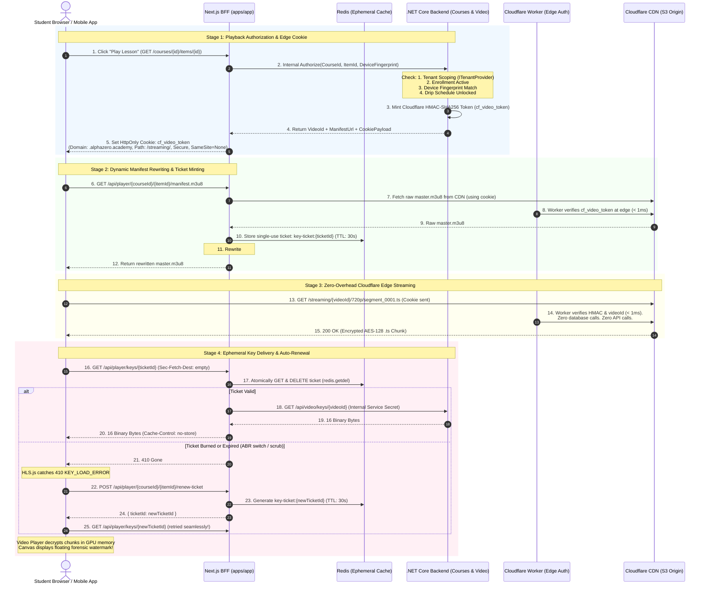

# 🛡️ AlphaZero Video Security: End-to-End Architecture Plan (v2)

## Goal Description
Build a defense-in-depth video security pipeline for **AlphaZero Learning Academy** that stops automated pirating tools (`yt-dlp`, browser scrapers, account sharing, and unauthorized CDN bandwidth egress) while remaining 100% compatible with low-bandwidth Syrian/MENA environments and avoiding expensive proprietary DRM licensing fees.

### Core Architectural Decisions
1. **Edge CDN Delivery via Cloudflare CDN (not CloudFront):**
   - Cloudflare CDN edge fronting AWS S3 (or R2) origin.
   - Authentication at the edge via **Cloudflare Worker** validating an `HttpOnly` HMAC-signed session cookie (`cf_video_token`).
   - Zero database/API overhead on segment requests — edge verification takes `< 1ms`.
2. **Transcoding Flexibility (Dual-Transcoder Strategy):**
   - Supports both **Local FFmpeg** (MassTransit Job Consumer) and **AWS MediaConvert** (Serverless).
   - Both produce AES-128 encrypted HLS streams using a shared 16-byte key generated by `DefaultVideoEncryptionService` and stored in PostgreSQL `VideoSecrets`.
   - Raw manifests in S3 use a placeholder key URL that is rewritten at playback time.
3. **BFF Origin & Key Masking via Next.js Dynamic Manifest Rewriting:**
   - Next.js BFF (`apps/app`) fetches the raw `.m3u8` from Cloudflare CDN and dynamically rewrites `#EXT-X-KEY` to point to a temporary ephemeral ticket: `/api/player/keys/{ticketId}`.
4. **Single-Use Ephemeral Key Tickets (Burn-After-Reading via Redis):**
   - Tickets are stored in Redis with 30s TTL.
   - Consumed atomically via `redis.getdel`.
   - Any replay attack or `yt-dlp` run receives `410 Gone`.
5. **Resilient HLS.js Auto-Renewal:**
   - Client player catches `410 Gone` / `KEY_LOAD_ERROR` and requests a new ticket from `/api/player/{courseId}/{itemId}/renew-ticket` (authenticated by session + device fingerprint), seamlessly handling ABR rendition switches without interrupting playback.
6. **Context-Aware Device Enforcement:**
   - Enforces `LoggedInDeviceFingerprint == RequestDeviceFingerprint` before issuing playback session cookies or renewing tickets.
7. **Dynamic Forensic Watermarking:**
   - Floating HTML5 Canvas overlay displaying student name, masked phone number, and student ID across the video player.

---

## Architecture Overview



---

## What Already Exists (Reuse, Don't Rebuild)

| Component | Location | Status | Action |
|-----------|----------|--------|--------|
| Transcoder Strategy (`FFMPEG` & `MediaConvert`) | `Modules/VideoUploading/Application/VideoTranscodingMetehod.cs` | ✅ Complete | Reuse as-is |
| FFmpeg Transcoding Consumer | `Modules/VideoUploading/Infrastructure/Consumers/FFmpegTranscodingConsumer.cs` | ✅ Complete | Ensure AES-128 keyinfo uses placeholder URI |
| MediaConvert Transcoding Service | `Modules/VideoUploading/Infrastructure/Services/MediaConvertTranscodingService.cs` | ✅ Complete | Ensure `job.json` uses placeholder URI |
| Key Storage & Generation | `Modules/VideoUploading/Infrastructure/Services/DefaultVideoEncryptionService.cs` | ✅ Complete | Point `KeyUrl` to placeholder |
| Key Delivery Endpoint | `Modules/VideoUploading/Presentation/Features/GetVideoKey.cs` | ✅ Complete | Keep as internal endpoint for BFF |
| Cloudflare CDN Service | `Modules/VideoUploading/Infrastructure/Streaming/CdnVideoStreamingService.cs` | ✅ Complete | Update from `http://` to `https://` |
| S3 &rarr; CDN Sync Service | `Modules/VideoUploading/Infrastructure/Services/S3VideoCdnSyncService.cs` | ✅ Complete | Reuse as-is |

---

## Proposed Changes

### Component 1: Cloudflare Edge Authentication

#### [NEW] `infrastructure/cloudflare/video-auth-worker.js`
Cloudflare Worker deployed on `cdn.alphazero.academy` intercepting `/streaming/*`.
Validates `cf_video_token` cookie containing `v={videoId}&u={userId}&exp={expiry}&sig={hmac}`.

```javascript
export default {
  async fetch(request, env) {
    const url = new URL(request.url);

    // Only gate /streaming/ paths
    if (!url.pathname.startsWith("/streaming/")) {
      return fetch(request);
    }

    // Extract cf_video_token cookie
    const cookieHeader = request.headers.get("Cookie") || "";
    const cookies = Object.fromEntries(
      cookieHeader.split(";").map(c => {
        const [k, ...v] = c.trim().split("=");
        return [k, v.join("=")];
      })
    );

    const tokenStr = cookies["cf_video_token"];
    if (!tokenStr) {
      return new Response("Forbidden: Missing video authorization cookie", { status: 403 });
    }

    // Parse token: v=...&u=...&exp=...&sig=...
    const params = new URLSearchParams(tokenStr);
    const videoId = params.get("v");
    const exp = params.get("exp");
    const sig = params.get("sig");

    if (!videoId || !exp || !sig) {
      return new Response("Forbidden: Malformed authorization token", { status: 403 });
    }

    // Verify expiration
    const now = Math.floor(Date.now() / 1000);
    if (parseInt(exp, 10) < now) {
      return new Response("Forbidden: Video session expired", { status: 403 });
    }

    // Verify videoId matches URL path: /streaming/{videoId}/...
    const expectedPrefix = `/streaming/${videoId}/`;
    if (!url.pathname.startsWith(expectedPrefix)) {
      return new Response("Forbidden: Token not valid for this video", { status: 403 });
    }

    // Verify HMAC signature
    const message = `v=${videoId}&u=${params.get("u")}&exp=${exp}`;
    const encoder = new TextEncoder();
    const key = await crypto.subtle.importKey(
      "raw",
      encoder.encode(env.CF_VIDEO_HMAC_SECRET),
      { name: "HMAC", hash: "SHA-256" },
      false,
      ["verify"]
    );

    const sigBytes = new Uint8Array(
      sig.match(/.{2}/g).map(b => parseInt(b, 16))
    );

    const valid = await crypto.subtle.verify("HMAC", key, sigBytes, encoder.encode(message));
    if (!valid) {
      return new Response("Forbidden: Invalid signature", { status: 403 });
    }

    // Token is valid -> pass to S3 origin or serve from edge cache
    return fetch(request);
  }
};
```

---

### Component 2: .NET Core Cookie Signer & Playback Session Endpoint

#### [NEW] `src/alphazero-api/Shared/Security/ICloudflareCookieSigner.cs`
```csharp
namespace AlphaZero.Shared.Security;

public record VideoPlaybackCookie(
    string CookieName,
    string CookieValue,
    string Domain,
    string Path,
    DateTimeOffset ExpiresAt);

public interface ICloudflareCookieSigner
{
    VideoPlaybackCookie CreatePlaybackCookie(Guid videoId, Guid userId, TimeSpan lifetime);
}
```

#### [NEW] `src/alphazero-api/Shared/Infrastructure/Security/CloudflareCookieSigner.cs`
```csharp
using System.Security.Cryptography;
using System.Text;
using AlphaZero.Shared.Security;
using Microsoft.Extensions.Configuration;

namespace AlphaZero.Shared.Infrastructure.Security;

public class CloudflareCookieSigner : ICloudflareCookieSigner
{
    private readonly byte[] _secretBytes;
    private readonly string _domain;

    public CloudflareCookieSigner(IConfiguration config)
    {
        var secret = config["Cloudflare:VideoHmacSecret"] 
            ?? throw new ArgumentNullException("Cloudflare:VideoHmacSecret");
        _secretBytes = Encoding.UTF8.GetBytes(secret);
        _domain = config["Cloudflare:CookieDomain"] ?? ".alphazero.academy";
    }

    public VideoPlaybackCookie CreatePlaybackCookie(Guid videoId, Guid userId, TimeSpan lifetime)
    {
        var expiresAt = DateTimeOffset.UtcNow.Add(lifetime);
        var exp = expiresAt.ToUnixTimeSeconds();
        var message = $"v={videoId}&u={userId}&exp={exp}";

        using var hmac = new HMACSHA256(_secretBytes);
        var signature = Convert.ToHexString(hmac.ComputeHash(Encoding.UTF8.GetBytes(message))).ToLowerInvariant();
        var cookieValue = $"{message}&sig={signature}";

        return new VideoPlaybackCookie(
            CookieName: "cf_video_token",
            CookieValue: cookieValue,
            Domain: _domain,
            Path: $"/streaming/{videoId}/",
            ExpiresAt: expiresAt);
    }
}
```

#### [NEW] `src/alphazero-api/Modules/Courses/Presentation/Features/GetPlaybackSession.cs`
Endpoint in Courses module validating enrollment, course publication status, device fingerprint, and issuing the Cloudflare cookie payload.

```csharp
using AlphaZero.Modules.Courses.Application.Courses.Queries.GetPlaybackSession;
using AlphaZero.Shared.Presentation.Extensions;
using AlphaZero.Shared.Security;
using FastEndpoints;
using Microsoft.AspNetCore.Http;

namespace AlphaZero.Modules.Courses.Presentation.Features;

public record GetPlaybackSessionRequest
{
    public Guid CourseId { get; init; }
    public Guid ItemId { get; init; }
}

public class GetPlaybackSessionEndpoint : Endpoint<GetPlaybackSessionRequest>
{
    private readonly ICoursesModule _module;
    private readonly ICloudflareCookieSigner _cookieSigner;

    public GetPlaybackSessionEndpoint(ICoursesModule module, ICloudflareCookieSigner cookieSigner)
    {
        _module = module;
        _cookieSigner = cookieSigner;
    }

    public override void Configure()
    {
        Get("api/courses/{CourseId:guid}/items/{ItemId:guid}/playback-session");
        Description(d => d.WithTags("Course Streaming"));
    }

    public override async Task HandleAsync(GetPlaybackSessionRequest req, CancellationToken ct)
    {
        var deviceFingerprint = HttpContext.Request.Headers["X-Device-Fingerprint"].ToString();
        var query = new GetPlaybackSessionQuery(req.CourseId, req.ItemId, deviceFingerprint);
        var result = await _module.Send(query, ct);

        if (result.IsError)
        {
            await this.SendErrorResponseAsync(result.Errors, ct);
            return;
        }

        var session = result.Value;
        var cookie = _cookieSigner.CreatePlaybackCookie(session.VideoId, session.UserId, TimeSpan.FromHours(4));

        await SendOkAsync(new
        {
            session.VideoId,
            session.ManifestUrl,
            Cookie = cookie
        }, ct);
    }
}
```

---

### Component 3: Next.js BFF Shield, Dynamic Rewriter & Ticket Renewal

#### [NEW] `src/alphazero-frontend/apps/app/app/api/player/[courseId]/[itemId]/manifest/route.ts`
Route handler fetching the raw `.m3u8` from Cloudflare CDN, generating a 30-second single-use key ticket, and rewriting the `#EXT-X-KEY` header before serving.

```typescript
import { type NextRequest, NextResponse } from "next/server";
import { getSession } from "@/lib/auth";
import { redis } from "@/lib/redis";
import crypto from "crypto";

export async function GET(
  request: NextRequest,
  { params }: { params: Promise<{ courseId: string; itemId: string }> }
) {
  const { courseId, itemId } = await params;
  const session = await getSession(request);

  if (!session?.user) {
    return new NextResponse("Unauthorized", { status: 401 });
  }

  const deviceFingerprint = request.headers.get("x-device-fingerprint") || "";

  // 1. Request playback session from .NET Core
  const sessionRes = await fetch(
    `${process.env.INTERNAL_DOTNET_API_URL}/api/courses/${courseId}/items/${itemId}/playback-session`,
    {
      headers: {
        "X-Tenant-Id": session.user.tenantId,
        "X-User-Id": session.user.id,
        "X-Device-Fingerprint": deviceFingerprint,
      },
    }
  );

  if (!sessionRes.ok) {
    return new NextResponse("Forbidden", { status: sessionRes.status });
  }

  const { videoId, manifestUrl, cookie } = await sessionRes.json();

  // 2. Fetch raw manifest from Cloudflare CDN using cookie
  const manifestRes = await fetch(manifestUrl, {
    headers: {
      Cookie: `${cookie.cookieName}=${cookie.cookieValue}`,
    },
  });

  if (!manifestRes.ok) {
    return new NextResponse("Failed to load upstream manifest", { status: 502 });
  }

  let manifestText = await manifestRes.text();

  // 3. Generate 30-second single-use ticket in Redis
  const ticketId = crypto.randomBytes(16).toString("hex");
  const ticketPayload = JSON.stringify({
    videoId,
    userId: session.user.id,
    deviceFingerprint,
    createdAt: Date.now(),
  });

  await redis.set(`key-ticket:${ticketId}`, ticketPayload, "EX", 30);

  // 4. Rewrite #EXT-X-KEY line to proxy through Next.js BFF
  const keyProxyUrl = `/api/player/keys/${ticketId}`;
  manifestText = manifestText.replace(
    /#EXT-X-KEY:METHOD=AES-128,URI="[^"]+"/g,
    `#EXT-X-KEY:METHOD=AES-128,URI="${keyProxyUrl}"`
  );

  const response = new NextResponse(manifestText, {
    headers: {
      "Content-Type": "application/vnd.apple.mpegurl",
      "Cache-Control": "no-store, no-cache, must-revalidate",
    },
  });

  // Attach Cloudflare CDN auth cookie
  response.cookies.set(cookie.cookieName, cookie.cookieValue, {
    domain: cookie.domain,
    path: cookie.path,
    secure: true,
    httpOnly: true,
    sameSite: "none",
  });

  return response;
}
```

#### [NEW] `src/alphazero-frontend/apps/app/app/api/player/[courseId]/[itemId]/renew-ticket/route.ts`
Endpoint called by HLS.js client when a `410 Gone` error occurs (e.g. on resolution switch or seek).

```typescript
import { type NextRequest, NextResponse } from "next/server";
import { getSession } from "@/lib/auth";
import { redis } from "@/lib/redis";
import crypto from "crypto";

export async function POST(
  request: NextRequest,
  { params }: { params: Promise<{ courseId: string; itemId: string }> }
) {
  const { courseId, itemId } = await params;
  const session = await getSession(request);

  if (!session?.user) {
    return new NextResponse("Unauthorized", { status: 401 });
  }

  const clientFingerprint = request.headers.get("x-device-fingerprint") || "";

  // Validate session with .NET API
  const sessionRes = await fetch(
    `${process.env.INTERNAL_DOTNET_API_URL}/api/courses/${courseId}/items/${itemId}/playback-session`,
    {
      headers: {
        "X-Tenant-Id": session.user.tenantId,
        "X-User-Id": session.user.id,
        "X-Device-Fingerprint": clientFingerprint,
      },
    }
  );

  if (!sessionRes.ok) {
    return new NextResponse("Forbidden", { status: sessionRes.status });
  }

  const { videoId } = await sessionRes.json();

  // Mint new 30s single-use ticket
  const ticketId = crypto.randomBytes(16).toString("hex");
  const ticketPayload = JSON.stringify({
    videoId,
    userId: session.user.id,
    deviceFingerprint: clientFingerprint,
    createdAt: Date.now(),
  });

  await redis.set(`key-ticket:${ticketId}`, ticketPayload, "EX", 30);

  return NextResponse.json({ ticketId });
}
```

#### [NEW] `src/alphazero-frontend/apps/app/app/api/player/keys/[ticket]/route.ts`
Burn-after-reading key endpoint. Consumes ticket atomically and retrieves the 16 bytes.

```typescript
import { type NextRequest, NextResponse } from "next/server";
import { getSession } from "@/lib/auth";
import { redis } from "@/lib/redis";

export async function GET(
  request: NextRequest,
  { params }: { params: Promise<{ ticket: string }> }
) {
  const { ticket } = await params;
  const session = await getSession(request);

  if (!session?.user) {
    return new NextResponse("Unauthorized", { status: 401 });
  }

  // 1. Anti-curl / Anti-yt-dlp: Verify browser fetch context
  const secFetchDest = request.headers.get("sec-fetch-dest");
  if (secFetchDest && secFetchDest !== "empty") {
    return new NextResponse("Forbidden: Invalid Fetch Destination", { status: 403 });
  }

  // 2. Burn-after-reading: Atomically retrieve and delete ticket
  const ticketData = await redis.getdel(`key-ticket:${ticket}`);
  if (!ticketData) {
    return new NextResponse("Expired or Already Redeemed Key Ticket", { status: 410 });
  }

  const { videoId, userId, deviceFingerprint } = JSON.parse(ticketData);

  // 3. Verify user and device integrity
  if (userId !== session.user.id) {
    return new NextResponse("Session Mismatch", { status: 403 });
  }

  const clientFingerprint = request.headers.get("x-device-fingerprint") || "";
  if (deviceFingerprint && clientFingerprint !== deviceFingerprint) {
    return new NextResponse("Device Mismatch", { status: 403 });
  }

  // 4. Server-to-server call to .NET API
  const backendRes = await fetch(
    `${process.env.INTERNAL_DOTNET_API_URL}/api/video/keys/${videoId}`,
    {
      headers: {
        "X-Internal-Service-Key": process.env.INTERNAL_API_SECRET!,
        "X-Tenant-Id": session.user.tenantId,
        "X-User-Id": session.user.id,
      },
    }
  );

  if (!backendRes.ok) {
    return new NextResponse("Key Not Found", { status: backendRes.status });
  }

  const keyBytes = await backendRes.arrayBuffer();

  return new NextResponse(keyBytes, {
    headers: {
      "Content-Type": "application/octet-stream",
      "Cache-Control": "no-store, no-cache, must-revalidate, private",
      "Pragma": "no-cache",
    },
  });
}
```

---

### Component 4: Video Player with Forensic Watermark & Resilient Key Retry

#### [NEW] `src/alphazero-frontend/packages/design-system/components/video-player/video-player.tsx`
Configured `HLS.js` player with `xhrSetup` for cookies, error retry hook for `410 Gone`, and forensic watermark canvas.

```typescript
"use client";

import { useEffect, useRef } from "react";
import Hls from "hls.js";
import { ForensicWatermark } from "./forensic-watermark";

interface VideoPlayerProps {
  courseId: string;
  itemId: string;
  studentName: string;
  phone: string;
  userId: string;
}

export function VideoPlayer({ courseId, itemId, studentName, phone, userId }: VideoPlayerProps) {
  const videoRef = useRef<HTMLVideoElement | null>(null);

  useEffect(() => {
    const video = videoRef.current;
    if (!video) return;

    const manifestUrl = `/api/player/${courseId}/${itemId}/manifest`;

    if (Hls.isSupported()) {
      const hls = new Hls({
        xhrSetup: (xhr) => {
          xhr.withCredentials = true; // Send cf_video_token cookie
        },
      });

      hls.loadSource(manifestUrl);
      hls.attachMedia(video);

      // Resilient key retry hook
      hls.on(Hls.Events.ERROR, async (event, data) => {
        if (
          data.details === Hls.ErrorDetails.KEY_LOAD_ERROR &&
          (data.response?.code === 410 || data.response?.code === 404)
        ) {
          try {
            const res = await fetch(`/api/player/${courseId}/${itemId}/renew-ticket`, {
              method: "POST",
            });
            if (res.ok) {
              const { ticketId } = await res.json();
              data.frag.decryptdata.uri = `/api/player/keys/${ticketId}`;
              hls.recoverMediaError();
            }
          } catch (err) {
            console.error("Failed to renew key ticket", err);
          }
        }
      });

      return () => hls.destroy();
    } else if (video.canPlayType("application/vnd.apple.mpegurl")) {
      video.src = manifestUrl;
    }
  }, [courseId, itemId]);

  return (
    <div className="relative aspect-video w-full overflow-hidden rounded-xl bg-black">
      <video ref={videoRef} controls className="h-full w-full" />
      <ForensicWatermark studentName={studentName} phone={phone} userId={userId} />
    </div>
  );
}
```

#### [NEW] `src/alphazero-frontend/packages/design-system/components/video-player/forensic-watermark.tsx`
Floating canvas watermark displaying student details.

```typescript
"use client";

import { useEffect, useRef } from "react";

interface ForensicWatermarkProps {
  studentName: string;
  phone: string;
  userId: string;
}

export function ForensicWatermark({ studentName, phone, userId }: ForensicWatermarkProps) {
  const canvasRef = useRef<HTMLCanvasElement | null>(null);

  useEffect(() => {
    const canvas = canvasRef.current;
    if (!canvas) return;
    const ctx = canvas.getContext("2d");
    if (!ctx) return;

    let posX = 20;
    let posY = 40;
    let speedX = 0.5;
    let speedY = 0.3;
    let animId: number;

    const watermarkText = `${studentName} • ${phone} • ID: ${userId.slice(0, 8)}`;

    const render = () => {
      ctx.clearRect(0, 0, canvas.width, canvas.height);
      ctx.font = "12px sans-serif";
      ctx.fillStyle = "rgba(255, 255, 255, 0.28)";
      ctx.shadowColor = "rgba(0, 0, 0, 0.6)";
      ctx.shadowBlur = 4;
      ctx.fillText(watermarkText, posX, posY);

      posX += speedX;
      posY += speedY;

      if (posX < 10 || posX > canvas.width - 220) speedX *= -1;
      if (posY < 20 || posY > canvas.height - 20) speedY *= -1;

      animId = requestAnimationFrame(render);
    };

    render();
    return () => cancelAnimationFrame(animId);
  }, [studentName, phone, userId]);

  return (
    <canvas
      ref={canvasRef}
      width={640}
      height={360}
      className="pointer-events-none absolute inset-0 z-20 h-full w-full select-none"
    />
  );
}
```

---

## NOT in Scope

| Item | Rationale |
|------|-----------|
| Cloudflare Stream (managed) | Redundant with existing FFmpeg & MediaConvert infrastructure; higher per-minute SaaS cost. |
| Hardware DRM (Widevine / FairPlay) | Expensive licensing and player complexity; AES-128 + burn-after-reading + watermarking provides sufficient protection for regional e-learning. |
| IP-address binding on cookies | Incompatible with mobile networks in MENA where dynamic IP reallocation and cell tower handoffs occur frequently. |
| S3 to R2 migration | S3 origin remains intact; Cloudflare CDN proxies S3. Storage migration can be evaluated independently later. |

---

## Failure Modes & Edge Case Analysis

| Component | Failure Scenario | Mitigation | User Experience |
|-----------|------------------|------------|-----------------|
| Edge Cookie | Cookie expires during a 2-hour lecture | `GetPlaybackSession` issues a 4-hour cookie lifetime; player can silently refresh cookie on section boundaries. | Seamless playback without interruption. |
| Ephemeral Ticket | ABR switches quality (720p &rarr; 480p) and re-fetches key | Client `HLS.js` error hook catches `410 Gone` and calls `/renew-ticket`. | Instant recovery; zero video freeze. |
| Redis Outage | Redis unavailable for ephemeral tickets | BFF falls back to in-memory short-lived cache (LRU with 30s TTL). | Playback continues; warning logged. |
| Scraper (`yt-dlp`) | Attacker copies `.m3u8` link from browser | Fails immediately: missing `cf_video_token` cookie yields `403`; burned key ticket yields `410`. | Download fails. |

---

## Worktree Parallelization Strategy

Sequential implementation is not required across modules. The work breaks cleanly into two parallel lanes:

- **Lane A (Backend & Cloudflare Edge):**
  - Shared Security: `ICloudflareCookieSigner` + `CloudflareCookieSigner.cs`
  - Courses Module: `GetPlaybackSession.cs` endpoint
  - Cloudflare Worker: `video-auth-worker.js` + `wrangler.toml`
- **Lane B (Frontend BFF & Player Component):**
  - Next.js BFF: Manifest rewrite, ticket renewal, and key delivery routes
  - Player Component: `VideoPlayer.tsx` with HLS.js error recovery and `ForensicWatermark.tsx`

---

## Implementation Tasks

- [ ] **T1 (P1, human: ~1h / CC: ~10min)** — `Shared/Security` — Create `ICloudflareCookieSigner` & `CloudflareCookieSigner.cs`
  - Files: `src/alphazero-api/AlphaZero.Shared/Security/ICloudflareCookieSigner.cs`, `src/alphazero-api/AlphaZero.Shared/Infrastructure/Security/CloudflareCookieSigner.cs`
  - Verify: Unit test HMAC signature verification matches Cloudflare Worker crypto.

- [ ] **T2 (P1, human: ~1.5h / CC: ~15min)** — `Courses Module` — Implement `GetPlaybackSession` endpoint
  - Files: `src/alphazero-api/Modules/Courses/Presentation/Features/GetPlaybackSession.cs`
  - Verify: Integration test validates enrollment check, device fingerprint matching, and cookie payload.

- [ ] **T3 (P1, human: ~1h / CC: ~10min)** — `Infrastructure` — Cloudflare Edge Video Auth Worker
  - Files: `infrastructure/cloudflare/video-auth-worker.js`, `infrastructure/cloudflare/wrangler.toml`
  - Verify: Cloudflare worker unit tests (reject requests without valid cookie, allow valid cookie matching videoId).

- [ ] **T4 (P1, human: ~2h / CC: ~15min)** — `Next.js BFF` — Manifest rewriter & ticket renewal routes
  - Files: `src/alphazero-frontend/apps/app/app/api/player/[courseId]/[itemId]/manifest/route.ts`, `src/alphazero-frontend/apps/app/app/api/player/[courseId]/[itemId]/renew-ticket/route.ts`
  - Verify: Manifest rewriting unit tests assert `#EXT-X-KEY` is rewritten and ticket is stored in Redis.

- [ ] **T5 (P1, human: ~1h / CC: ~10min)** — `Next.js BFF` — Ephemeral key delivery endpoint with `GETDEL`
  - Files: `src/alphazero-frontend/apps/app/app/api/player/keys/[ticket]/route.ts`
  - Verify: Vitest asserts first request returns 200 and second request returns 410.

- [ ] **T6 (P2, human: ~1.5h / CC: ~15min)** — `Design System` — Resilient HLS player with Watermark
  - Files: `src/alphazero-frontend/packages/design-system/components/video-player/video-player.tsx`, `src/alphazero-frontend/packages/design-system/components/video-player/forensic-watermark.tsx`
  - Verify: Visual test and mock 410 retry in Vitest.

- [ ] **T7 (P2, human: ~30min / CC: ~5min)** — `VideoUploading` — Update streaming URL protocol to HTTPS
  - Files: `src/alphazero-api/Modules/VideoUploading/Infrastructure/Streaming/CdnVideoStreamingService.cs`
  - Verify: All manifest URLs generated start with `https://`.

---

## GSTACK REVIEW REPORT

| Runs | Status | Findings |
|:-----|:-------|:---------|
| 1    | CLEAR  | 0 blocking issues. Cloudflare CDN, dual transcoders, HttpOnly cookie auth, and HLS.js 410 retry agreed and locked in. |

**VERDICT:** APPROVED. All decisions resolved and aligned with user preferences and codebase realities.

NO UNRESOLVED DECISIONS
