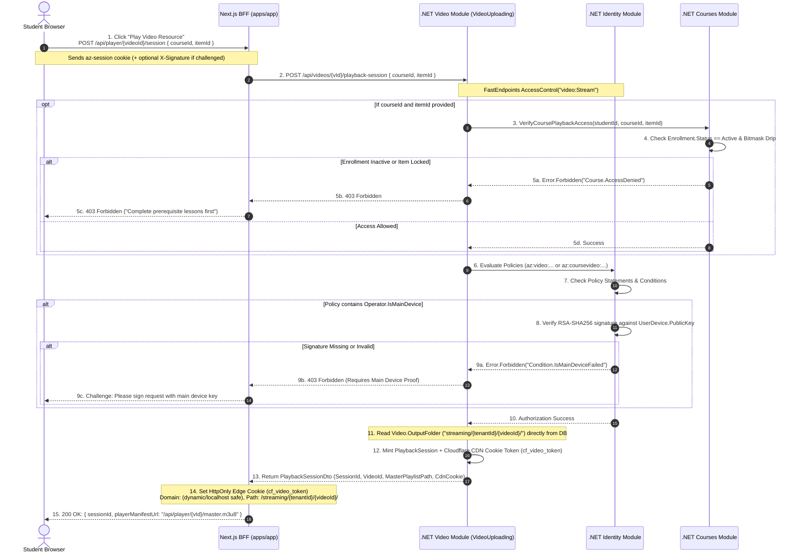
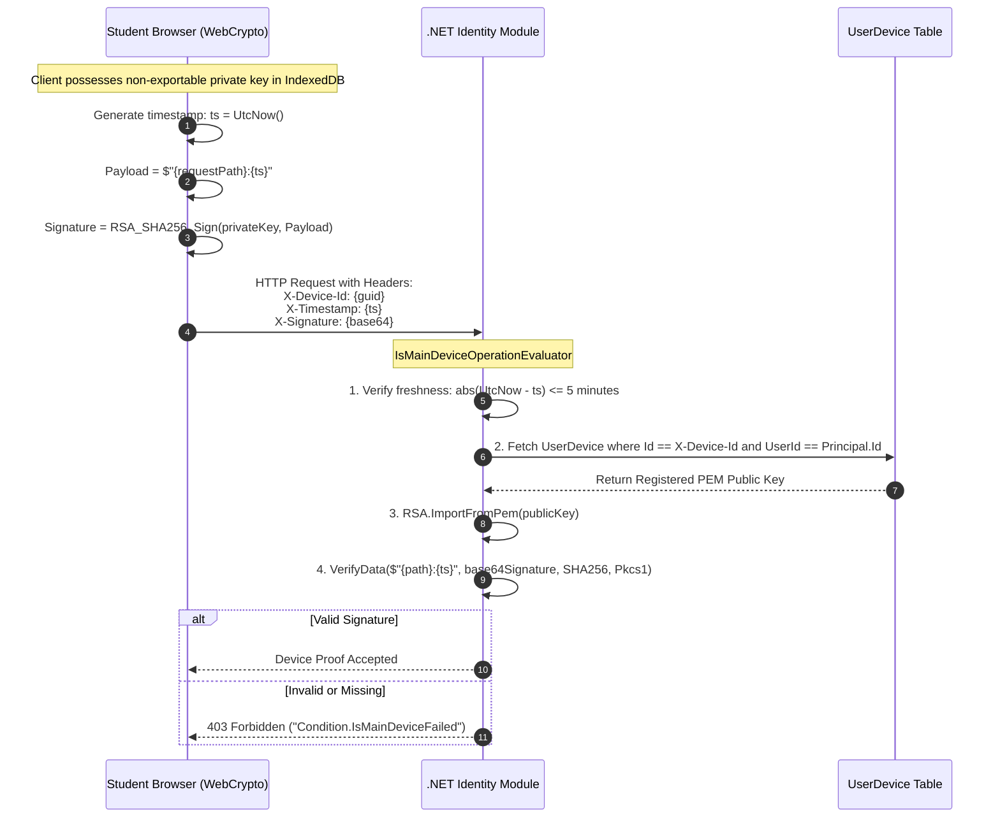
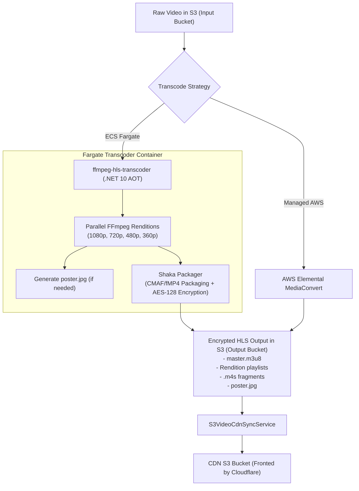
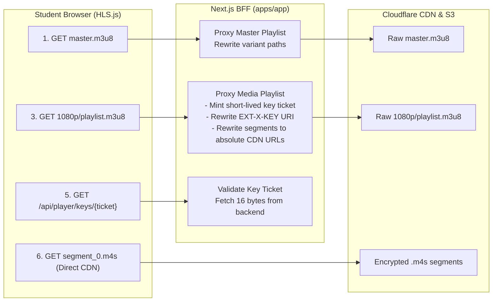
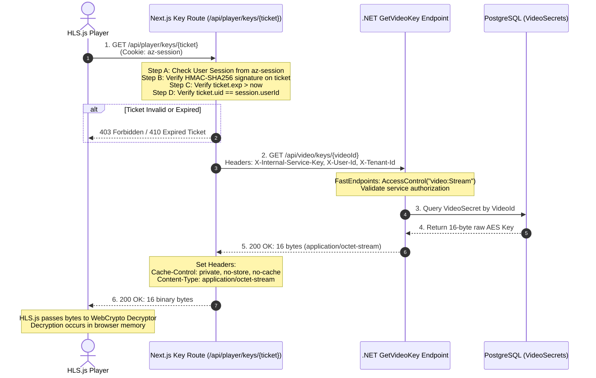
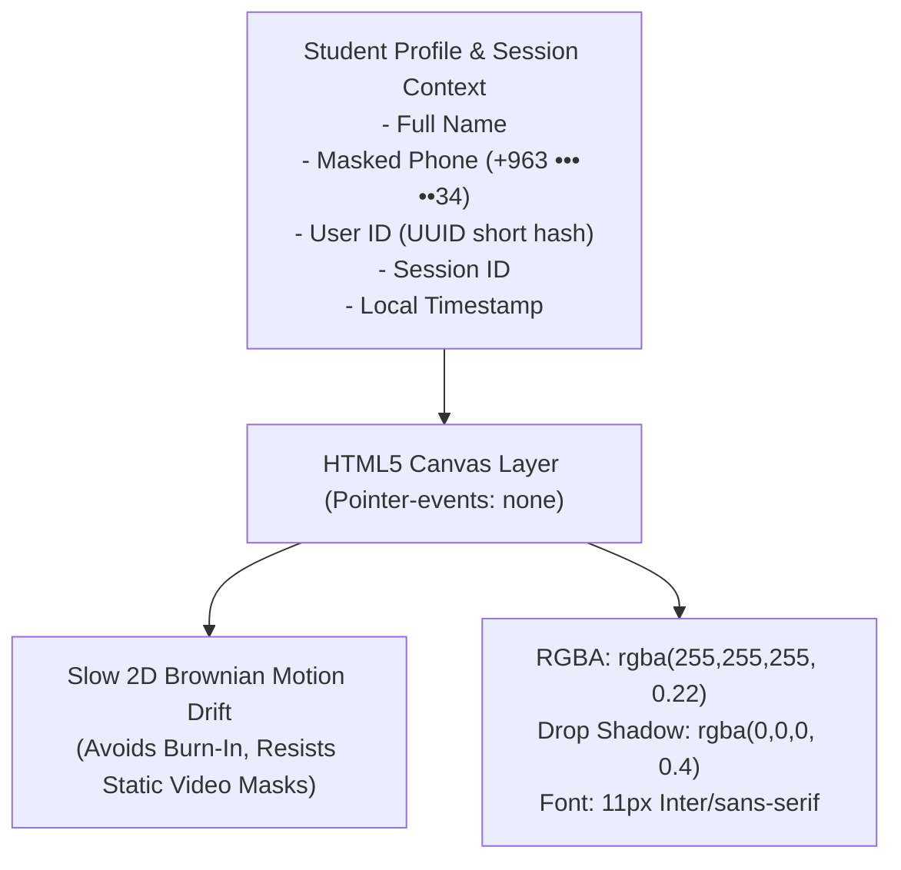
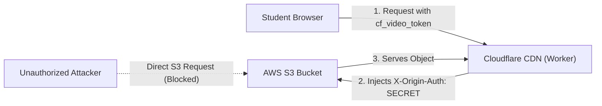

# 🛡️ AlphaZero Video Security: End-to-End Architecture Plan (v3)

## 1. Goal Description

Build a high-performance, cost-effective, defense-in-depth video security pipeline for **AlphaZero Learning Academy** tailored for low-bandwidth and high-latency environments (Syria/MENA). 

The architecture protects educational video assets against automated ripping (`yt-dlp`, automated scrapers), unauthorized CDN egress, hotlinking, and unmetered account sharing, while avoiding expensive proprietary DRM licensing fees (Widevine, FairPlay) and eliminating single points of failure in the streaming data path.

---

## 2. Core Architectural Decisions

1. **Resource-Level Authorization in Video Module (Decoupled from Courses):**
   - Playback session creation belongs to the **Video Module** (`Modules/VideoUploading`), not the Courses module.
   - Video is an autonomous domain asset that can be streamed in any context (course curriculum, library asset, preview teaser, or standalone webinar).
   - If a video is accessed within a course lesson, the client passes optional course context (`courseId`, `itemId`). The Video Module queries the Courses module via internal MassTransit request/response (`VerifyCoursePlaybackAccessRequest`) to verify active enrollment and drip completion.
   
2. **Decoupled Conditional Device Security (Policy-Driven Asymmetric Proof):**
   - Generic device fingerprints (`X-Device-Fingerprint`) are completely removed from the video streaming data plane.
   - Device verification occurs exclusively during the initial business authorization phase **if and only if** an assigned access policy contains an `Operator.IsMainDevice` condition.
   - Device proof uses AlphaZero's existing asymmetric cryptography (RSA-SHA256 signature over a server timestamp challenge verified against the student's registered public key in `Modules/Identity/Domain/Services/DeviceSignatureVerifiier.cs`).
   - Once authorized, downstream video streaming infrastructure (CDN tokens, playlist rewrites, key tickets, media segments) is completely agnostic to whether device proof was required.

3. **First-Class PlaybackSession in Video Module:**
   - Introduces an authoritative `PlaybackSession` owned by the Video Module that bridges domain authorization with edge streaming capability.
   - The session generates a scoped, cryptographically signed capability for edge CDN access and media playlist resolution.

4. **Stateless, Cryptographically Signed Key Tickets (Replacing Redis GETDEL):**
   - Key delivery tickets are short-lived (60–120s), scoped HMAC-SHA256 tokens minted by the BFF/Backend.
   - Replaces the fragile single-use Redis `GETDEL` pattern. In unstable regional networks, network retransmissions, player buffer resets, or multi-rendition key requests previously burned tickets prematurely, causing catastrophic `410 Gone` playback halts.
   - Keys remain protected because tickets are bound to active playback sessions, valid for a brief window, and redeemable only through authenticated channels.

5. **Shaka Packager Packaging & ClearKey/AES-128 Parity:**
   - Transcoding is performed by parallel FFmpeg workers (packaged as an ahead-of-time compiled container running in AWS ECS Fargate via Step Functions) or AWS MediaConvert.
   - Packaging is executed by **Shaka Packager**, generating CMAF/fMP4 renditions, variant playlists, and media manifests containing a deliberate placeholder key URI (`https://cdn.alphazero.academy/__AZ_VIDEO_KEY__`).
   - The Next.js BFF does **not** encrypt video, generate keys, or alter crypto parameters (`METHOD`, `IV`, or segment framing). Next.js acts strictly as a secure manifest rewriter, updating the placeholder URI to an ephemeral key endpoint.

6. **Hierarchical Playlist Rewriting & Direct CDN Segment Delivery:**
   - HLS manifests separate the Master playlist (`master.m3u8`) from Media playlists (`stream_0.m3u8` / `1080p.m3u8`). `#EXT-X-KEY` declarations exist **only in media playlists**.
   - Next.js proxies and rewrites both master and media playlists to maintain relative URI resolution.
   - **Zero Next.js segment proxying:** All video segment (`.m4s` / `.ts`) traffic routes directly from student players through Cloudflare CDN to a private S3 origin, authenticated via edge cookies in `< 1ms` with zero database or backend compute overhead.

7. **Private S3 Origin Enforcement:**
   - AWS S3 blocks all public access. The bucket policy permits access strictly from Cloudflare CDN using pre-shared origin headers (`X-Origin-Auth`) and Cloudflare IP whitelisting. Direct S3 access is impossible.

8. **Dynamic Visible Watermarking (Deterrence & Attribution):**
   - Replaces misleading "forensic watermark" terminology. A dynamic, floating HTML5 Canvas overlay projects student identity attributes (name, masked phone number, user ID, session ID, and timestamp) over the video viewport to deter screen recording and facilitate leak attribution.

---

## 3. Resource Hierarchy & Domain Model Alignment

### 3.1 Entity Relationship Diagram

AlphaZero structures curricula through hierarchical domain aggregates:

```mermaid
erDiagram
    Course ||--o{ CourseSection : "has sections"
    CourseSection ||--o{ CurriculumItem : "has items"
    CurriculumItem ||--o{ CurriculumResource : "owns resources"
    CurriculumResource }o--|| CourseAsset : "references"
    CourseAsset <|-- VideoCourseAsset : "TPH subtype"
    CourseAsset <|-- DocumentCourseAsset : "TPH subtype"
    CourseAsset <|-- AssessmentCourseAsset : "TPH subtype"
    VideoCourseAsset ||--|| Video : "points to"
    
    CurriculumItem {
        Guid Id PK
        Guid SectionId FK
        string Title
        int Order
        int BitIndex "Bitmask position"
        string MainType "Video | Quiz | Document"
    }

    CurriculumResource {
        Guid Id PK
        Guid CurriculumItemId FK
        Guid CourseAssetId FK
        int Order
        jsonb Metadata
    }

    CourseAsset {
        Guid Id PK
        Guid CourseId FK
        string ResourceArn "az:coursevideo:... or az:video:..."
        string Title
        CourseAssetState State "Available | InUse | Archived"
        CourseAssetType CourseAssetType "Video | Document | Assessment"
    }

    VideoCourseAsset {
        TimeSpan Duration
        string ThumbnailUrl
        string RelativeStreamingUrl
    }

    Video {
        Guid Id PK
        Guid TenantId
        string SourceKey
        string OutputFolder "streaming/{tenantId}/{videoId}/"
        VideoStatus Status
    }
```

### 3.2 Playback Authorization Target

A course item is **not** a video. A course item (e.g., "Lesson 3: Advanced Graph Theory") can comprise:
- Resource 0: Primary Lecture Video (`VideoCourseAsset`)
- Resource 1: Downloadable Lecture Slides (`DocumentCourseAsset`)
- Resource 2: Post-Lecture Quick Quiz (`AssessmentCourseAsset`)
- Resource 3: Supplemental Walkthrough Video (`VideoCourseAsset`)

Playback authorization answers:
> **"Is the current principal authorized to play Video asset `{videoId}` (and if accessed in a course context, is enrollment active and prerequisite drip completed for Course `{courseId}` and Item `{itemId}`)?"**

### 3.3 Selected Endpoint Architecture

```http
POST /api/videos/{videoId}/playback-session
```

**Request Body (Optional Context):**
```json
{
  "courseId": "optional-guid",
  "itemId": "optional-guid"
}
```

**Why this fits AlphaZero Modular Architecture best:**
1. **Module Autonomy & Single Responsibility:** Video streaming, manifest rewriting, key delivery, and CDN edge cookies belong entirely to the **Video Module** (`Modules/VideoUploading`). The Courses module is relieved of streaming/infrastructure concerns.
2. **Context-Aware Flexibility:** If `courseId` and `itemId` are provided, the Video Module queries the Courses module via internal MassTransit Request/Response (`VerifyCoursePlaybackAccessRequest`) to ensure the student is actively enrolled and has unlocked the prerequisite bitmask. If omitted, it allows standalone video playback (e.g. promotional videos, library assets).
3. **IAM ARN Alignment:** The endpoint evaluates `AccessControl("video:Stream", (req, tenantId) => req.CourseId.HasValue ? ResourceArn.ForCourseVideo(tenantId, req.VideoId, req.CourseId.Value) : ResourceArn.ForVideo(tenantId, req.VideoId))`.

---

## 4. Playback Authorization Flow

The authorization flow strictly isolates business entitlement from streaming mechanics:



---

## 5. Conditional Device-Proof Cryptography

### 5.1 Fingerprint vs. Cryptographic Device Proof

| Concept | Implementation in v2 (Removed) | Implementation in v3 (Adopted) |
|---|---|---|
| **Mechanism** | `X-Device-Fingerprint` header (User-Agent + Canvas hash). | Asymmetric Public/Private Key Challenge (`X-Device-Id`, `X-Timestamp`, `X-Signature`). |
| **Security Guarantee** | **None.** Trivial to spoof or copy between browsers with DevTools or `curl`. | **High.** Proof of possession of a private key stored in secure hardware (Secure Enclave / IndexedDB WebCrypto non-exportable key). |
| **Scope** | Universally checked on every streaming, key, and renew endpoint. | Evaluated **only** during playback session authorization, and **only** when an assigned policy mandates `Operator.IsMainDevice`. |
| **Streaming Impact** | Coupled streaming data path to device state. | Streaming path is 100% agnostic to device verification. |

### 5.2 The Verification Protocol

When an academy policy specifies `Operator.IsMainDevice`:



---

## 6. First-Class PlaybackSession Model

### 6.1 Data Structure

```csharp
namespace AlphaZero.Modules.Courses.Domain.Aggregates.Playback;

public sealed record PlaybackSession(
    Guid SessionId,
    Guid TenantId,
    Guid UserId,
    Guid CourseId,
    Guid CourseItemId,
    Guid ResourceId,
    Guid VideoId,
    string S3Prefix,
    DateTimeOffset CreatedAt,
    DateTimeOffset ExpiresAt
)
{
    public bool IsExpired(DateTimeOffset now) => now >= ExpiresAt;
}
```

### 6.2 Session Storage & Verification Strategy

We adopt a **Dual Capability & Ephemeral Verification** design:
1. **Stateless Signed Token:** The `PlaybackSession` payload is serialized and HMAC-SHA256 signed with an internal backend secret (`PlaybackSessionSecret`). The BFF receives this capability token.
2. **Lightweight Concurrency Tracker:** If tenant policy enforces `MaxConcurrentStreamsPerUser`, the backend registers `sessionId` in an in-memory/cache map `user-sessions:{userId}` with a sliding expiration.
3. **No Database Segment Touch:** Segment requests do not touch the database or cache. Key requests authenticate the stateless signed ticket in `< 0.1ms`.

---

## 7. Cloudflare CDN Capability Token (Edge Cookie)

### 7.1 Token Specification

The edge cookie `cf_video_token` grants direct player access to encrypted media chunks via Cloudflare CDN without hitting backend servers:

```text
cf_video_token = sid={sessionId}&v={videoId}&exp={expiryTimestamp}&sig={hmacSignature}
```

- `sid`: Unique PlaybackSession identifier.
- `v`: Video ID (or path hash) being accessed.
- `exp`: Unix timestamp (UTC) when edge capability expires (typically 4 hours).
- `sig`: Hexadecimal `HMAC-SHA256(env.CF_VIDEO_HMAC_SECRET, "sid={sid}&v={v}&exp={exp}")`.

### 7.2 Cookie Attributes

- **Name:** `cf_video_token`
- **Domain:** Dynamic (Omitted on `localhost` for local dev; set to `.alphazero.academy` or tenant root domain in production)
- **Path:** `/streaming/{tenantId}/{videoId}/`
- **SameSite:** `None`
- **Secure:** `true` (HTTPS only, except local dev)
- **HttpOnly:** `true` (JavaScript cannot inspect or alter)

### 7.3 Cloudflare Worker Execution Logic (`video-auth-worker.js`)

```javascript
export default {
  async fetch(request, env) {
    const url = new URL(request.url);
    const origin = request.headers.get("Origin") || "";

    const corsHeaders = {
      "Access-Control-Allow-Origin": origin || "*",
      "Access-Control-Allow-Credentials": "true",
      "Access-Control-Allow-Methods": "GET, HEAD, OPTIONS",
      "Access-Control-Allow-Headers": "Range, Cookie, Content-Type, Accept, Origin",
      "Access-Control-Expose-Headers": "Content-Length, Content-Range, Date",
      "Vary": "Origin",
    };

    // 1. Handle CORS preflight
    if (request.method === "OPTIONS") {
      return new Response(null, {
        status: 204,
        headers: corsHeaders,
      });
    }

    // Only authenticate streaming media paths
    if (!url.pathname.startsWith("/streaming/")) {
      return fetch(request);
    }

    // Extract cf_video_token from Cookie header
    const cookieHeader = request.headers.get("Cookie") || "";
    const cookies = Object.fromEntries(
      cookieHeader.split(";").map(c => {
        const [k, ...v] = c.trim().split("=");
        return [k, v.join("=")];
      })
    );

    const tokenStr = cookies["cf_video_token"];
    if (!tokenStr) {
      return new Response("Forbidden: Missing video authorization capability", { 
        status: 403, 
        headers: corsHeaders 
      });
    }

    const params = new URLSearchParams(tokenStr);
    const sid = params.get("sid");
    const videoId = params.get("v");
    const exp = params.get("exp");
    const sig = params.get("sig");

    if (!sid || !videoId || !exp || !sig) {
      return new Response("Forbidden: Malformed capability token", { 
        status: 403, 
        headers: corsHeaders 
      });
    }

    // 2. Expiration Check
    const now = Math.floor(Date.now() / 1000);
    if (parseInt(exp, 10) < now) {
      return new Response("Forbidden: Streaming capability expired", { 
        status: 403, 
        headers: corsHeaders 
      });
    }

    // 3. Path Scoping Check: URL must be /streaming/{tenantId}/{videoId}/...
    if (!url.pathname.includes(`/${videoId}/`)) {
      return new Response("Forbidden: Token not scoped to this video asset", { 
        status: 403, 
        headers: corsHeaders 
      });
    }

    // 4. HMAC Verification (SubtleCrypto)
    const message = `sid=${sid}&v=${videoId}&exp=${exp}`;
    const encoder = new TextEncoder();
    const key = await crypto.subtle.importKey(
      "raw",
      encoder.encode(env.CF_VIDEO_HMAC_SECRET),
      { name: "HMAC", hash: "SHA-256" },
      false,
      ["verify"]
    );

    const sigBytes = new Uint8Array(
      sig.match(/.{2}/g).map(b => parseInt(b, 16))
    );

    const isValid = await crypto.subtle.verify("HMAC", key, sigBytes, encoder.encode(message));
    if (!isValid) {
      return new Response("Forbidden: Invalid capability signature", { 
        status: 403, 
        headers: corsHeaders 
      });
    }

    // 5. Authorized -> Pass to S3 Origin with Origin Secret Header
    const originRequest = new Request(request);
    originRequest.headers.set("X-Origin-Auth", env.S3_ORIGIN_AUTH_SECRET);
    
    const response = await fetch(originRequest);
    const modifiedResponse = new Response(response.body, response);
    for (const [k, v] of Object.entries(corsHeaders)) {
      modifiedResponse.headers.set(k, v);
    }
    return modifiedResponse;
  }
};
```

---

## 8. Shaka Packager Encryption & Packaging Pipeline

### 8.1 Dual-Transcoder Architecture

AlphaZero supports two encoding pipelines producing identical rendition streams:
1. **Serverless FFmpeg Worker:** Containerized .NET 10 Native AOT runner (`ffmpeg-hls-transcoder`) in AWS ECS Fargate orchestrated via AWS Step Functions.
2. **AWS Elemental MediaConvert:** Cloud-managed transcoding for high-volume enterprise queues.

Both transcoders execute parallel multi-rendition H.264 encoding with keyframe alignment, and feed **Shaka Packager** for CMAF/fMP4 packaging and ClearKey AES-128 encryption.



### 8.2 Shaka Packager Invocation & Placeholder Key URI

Shaka Packager is invoked with a well-defined placeholder URI:

```bash
packager \
  in=1080p.mp4,stream=video,output=1080p/stream.m4s,playlist_name=1080p/playlist.m3u8,iframe_playlist_name=1080p/iframe.m3u8 \
  in=720p.mp4,stream=video,output=720p/stream.m4s,playlist_name=720p/playlist.m3u8,iframe_playlist_name=720p/iframe.m3u8 \
  in=480p.mp4,stream=video,output=480p/stream.m4s,playlist_name=480p/playlist.m3u8,iframe_playlist_name=480p/iframe.m3u8 \
  in=360p.mp4,stream=video,output=360p/stream.m4s,playlist_name=360p/playlist.m3u8,iframe_playlist_name=360p/iframe.m3u8 \
  in=audio.mp4,stream=audio,output=audio/stream.m4s,playlist_name=audio/playlist.m3u8,hls_group_id=audio \
  --enable_raw_key_encryption \
  --keys label=:key_id=6d76f25cb17f5e16b8eaef6bbf582d8e:key=cb541084c99731aef4fff74500c12ead \
  --protection_scheme cbcs \
  --hls_master_playlist_output master.m3u8 \
  --hls_key_uri "https://cdn.alphazero.academy/__AZ_VIDEO_KEY__" \
  --fragment_duration 2 \
  --segment_duration 6
```

> [!IMPORTANT]
> **Strict Division of Responsibilities:**
> - **Shaka Packager:** Encrypts media, aligns fragment boxes (`sidx`, `moof`, `mdat`), and writes `#EXT-X-KEY` with the placeholder URI.
> - **Next.js BFF:** Modifies **only** the `URI="..."` attribute in media playlists. It never touches media bytes, `METHOD`, or `IV`.
> - **.NET Core:** Securely stores and serves the raw 16-byte AES key from `VideoSecrets`.
> - **HLS.js:** Decrypts fragments in memory with the retrieved key.

---

## 9. Concrete HLS Manifest Examples (Before & After Rewriting)

### 9.1 Master Playlist (`master.m3u8`)

#### Raw Upstream Manifest (Stored in S3):
```m3u8
#EXTM3U
#EXT-X-VERSION:7

#EXT-X-MEDIA:TYPE=AUDIO,GROUP-ID="audio",NAME="English",DEFAULT=YES,AUTOSELECT=YES,URI="audio/playlist.m3u8"

#EXT-X-STREAM-INF:BANDWIDTH=6000000,RESOLUTION=1920x1080,CODECS="avc1.640028,mp4a.40.2",AUDIO="audio"
1080p/playlist.m3u8

#EXT-X-STREAM-INF:BANDWIDTH=3500000,RESOLUTION=1280x720,CODECS="avc1.64001f,mp4a.40.2",AUDIO="audio"
720p/playlist.m3u8

#EXT-X-STREAM-INF:BANDWIDTH=1500000,RESOLUTION=854x480,CODECS="avc1.4d401f,mp4a.40.2",AUDIO="audio"
480p/playlist.m3u8

#EXT-X-STREAM-INF:BANDWIDTH=800000,RESOLUTION=640x360,CODECS="avc1.4d401e,mp4a.40.2",AUDIO="audio"
360p/playlist.m3u8
```

#### Rewritten Master Manifest (Served by BFF to Player):
```m3u8
#EXTM3U
#EXT-X-VERSION:7

#EXT-X-MEDIA:TYPE=AUDIO,GROUP-ID="audio",NAME="English",DEFAULT=YES,AUTOSELECT=YES,URI="/api/player/c1/i1/r1/media/audio/playlist.m3u8?s=SIG"

#EXT-X-STREAM-INF:BANDWIDTH=6000000,RESOLUTION=1920x1080,CODECS="avc1.640028,mp4a.40.2",AUDIO="audio"
/api/player/c1/i1/r1/media/1080p/playlist.m3u8?s=SIG

#EXT-X-STREAM-INF:BANDWIDTH=3500000,RESOLUTION=1280x720,CODECS="avc1.64001f,mp4a.40.2",AUDIO="audio"
/api/player/c1/i1/r1/media/720p/playlist.m3u8?s=SIG

#EXT-X-STREAM-INF:BANDWIDTH=1500000,RESOLUTION=854x480,CODECS="avc1.4d401f,mp4a.40.2",AUDIO="audio"
/api/player/c1/i1/r1/media/480p/playlist.m3u8?s=SIG

#EXT-X-STREAM-INF:BANDWIDTH=800000,RESOLUTION=640x360,CODECS="avc1.4d401e,mp4a.40.2",AUDIO="audio"
/api/player/c1/i1/r1/media/360p/playlist.m3u8?s=SIG
```

### 9.2 Media Playlist (`1080p/playlist.m3u8`)

#### Raw Upstream Manifest from S3:
```m3u8
#EXTM3U
#EXT-X-VERSION:7
#EXT-X-TARGETDURATION:6
#EXT-X-MEDIA-SEQUENCE:0
#EXT-X-PLAYLIST-TYPE:VOD

#EXT-X-KEY:METHOD=SAMPLE-AES,URI="https://cdn.alphazero.academy/__AZ_VIDEO_KEY__",KEYFORMAT="identity",IV=0x6d76f25cb17f5e16b8eaef6bbf582d8e

#EXT-X-MAP:URI="init.mp4"

#EXTINF:6.000,
segment_0.m4s
#EXTINF:6.000,
segment_1.m4s
#EXTINF:6.000,
segment_2.m4s
#EXT-X-ENDLIST
```

#### Rewritten Media Manifest Served by BFF:
```m3u8
#EXTM3U
#EXT-X-VERSION:7
#EXT-X-TARGETDURATION:6
#EXT-X-MEDIA-SEQUENCE:0
#EXT-X-PLAYLIST-TYPE:VOD

#EXT-X-KEY:METHOD=SAMPLE-AES,URI="/api/player/keys/eyTa-KEY-TICKET-TOKEN",KEYFORMAT="identity",IV=0x6d76f25cb17f5e16b8eaef6bbf582d8e

#EXT-X-MAP:URI="https://cdn.alphazero.academy/streaming/tenant-123/video-456/1080p/init.mp4"

#EXTINF:6.000,
https://cdn.alphazero.academy/streaming/tenant-123/video-456/1080p/segment_0.m4s
#EXTINF:6.000,
https://cdn.alphazero.academy/streaming/tenant-123/video-456/1080p/segment_1.m4s
#EXTINF:6.000,
https://cdn.alphazero.academy/streaming/tenant-123/video-456/1080p/segment_2.m4s
#EXT-X-ENDLIST
```

> [!TIP]
> **Key Manifest Invariants:**
> - `METHOD` is unchanged (`SAMPLE-AES` or `AES-128`).
> - `IV` is unchanged.
> - `KEYFORMAT` is unchanged.
> - Media segment URLs are rewritten to **absolute CDN URLs** (`https://cdn.alphazero.academy/streaming/...`), so HLS.js fetches all segments directly from Cloudflare, completely bypassing Next.js!
> - The AES key bytes are **never embedded in the playlist**.

---

## 10. BFF Manifest & Media Playlist Rewriting Architecture

Next.js handles manifest requests as a lightweight string streaming transform:



### 10.1 Relative URL Disambiguation Strategy

Because media playlists are served via `/api/player/.../media/{rendition}/playlist.m3u8` and media segments reside at `https://cdn.alphazero.academy/streaming/{tenantId}/{videoId}/{rendition}/`, relative segment references in raw playlists (`segment_0.m4s`) would fail if resolved against the Next.js origin.

**The Solution:**
During media playlist rewriting, the BFF prepends the canonical CDN base URL to all `#EXT-X-MAP:URI` and segment URI lines. This guarantees that:
1. Manifest parsing remains RFC-8216 compliant.
2. Browsers resolve all high-bandwidth media segments directly against Cloudflare edge nodes.

---

## 11. Stateless Key Ticket Design

### 11.1 Why Stateless Signed Tickets Replace Redis GETDEL

In v2, Redis `GETDEL` was proposed as a "burn-after-reading" lock. In real-world low-bandwidth deployments, this caused critical failures:
1. **Adaptive Bitrate Shifts:** When a player shifts from 1080p to 720p or audio track, it re-reads `#EXT-X-KEY`. If the key was deleted, playback halted with `410 Gone`.
2. **Packet Drops & Retransmission:** In high-latency regional connections, if a key HTTP response is dropped or delayed, the browser retries the request. A burned ticket causes the retry to fail with `410 Gone`.
3. **Operational Overhead:** Redis becomes a hard runtime dependency in the critical path of every video play.

### 11.2 Ticket Payload & Minting

The key ticket is a Base64URL-encoded, HMAC-SHA256 authenticated token:

```json
{
  "sid": "playback-session-guid",
  "vid": "video-guid",
  "uid": "user-guid",
  "exp": 1726830120,
  "nce": "a1b2c3d4"
}
```

- **Lifetime:** 120 seconds.
- **Scope:** Strictly bound to `sid` (PlaybackSession), `vid` (Video ID), and `uid` (User ID).
- **Verification:** Pure CPU crypto. The BFF or Backend verifies the HMAC signature and expiration timestamp in `< 0.05ms`.
- **Replay Resilience:** During its 120s lifetime, the legitimate player can fetch the key repeatedly across ABR switches and retry on network dropouts. After 120s, the ticket expires naturally.

---

## 12. Key Retrieval Flow & Reality Check

### 12.1 Detailed Key Retrieval Sequence



### 12.2 Security Reality Check: AES-128 vs. Hardware DRM

> [!WARNING]
> **ClearKey / AES-128 is NOT Hardware DRM (Widevine / FairPlay).**
> - The browser's JavaScript environment and network stack receive the 16-byte plaintext AES key.
> - An attacker with full control over the client machine (Chrome DevTools, modified player scripts, or memory inspection) can extract the key.
> - **What AES-128 + Signed Capability Protects Against:**
>   - ✅ Hotlinking and raw CDN scraping (users cannot share segment URLs).
>   - ✅ Automated ripping tools (`yt-dlp`, `ffmpeg -i`) that do not run a full browser authenticated session.
>   - ✅ Direct S3 bucket scraping.
>   - ✅ Unauthorized egress costs.
> - **What It Does NOT Protect Against:**
>   - ❌ An authorized student deliberately extracting keys via DevTools while logged in.
>   - ❌ Screen recording / HDMI capture cards.
> 
> For the Syrian/MENA regional market, where device diversity is high, hardware DRM licensing is cost-prohibitive, and network speed is low, AES-128 + Edge Capability + Dynamic Visible Watermarking provides the optimal trade-off of strong deterrent protection without prohibitive operational overhead.

---

## 13. Direct Cloudflare CDN Media Segment Flow

Segment requests require maximum throughput and zero backend latency:

```mermaid
flowchart LR
    subgraph Browser["Student Client"]
        Player["HLS.js / Video Tag"]
    end

    subgraph Cloudflare["Cloudflare Global CDN"]
        Edge["Cloudflare Edge Node"]
        Worker["video-auth-worker.js"]
        Cache["Edge Cache"]
    end

    subgraph AWS["AWS Cloud Infrastructure"]
        S3["Private S3 Origin<br/>(CdnS3 Bucket)"]
    end

    Player -->|"1. GET /streaming/{tId}/{vId}/1080p/segment_0.m4s<br/>(Cookie: cf_video_token)"| Edge
    Edge --> Worker
    Worker -->|"2. Verify HMAC, exp, and videoId in < 1ms"| Worker
    
    alt Token Valid
        Worker --> Cache
        Cache -->|"Cache Hit"| Edge
        Cache -.->|"Cache Miss (+ X-Origin-Auth)"| S3
        S3 -.-> Cache
        Edge -->|"3. 200 OK (Encrypted Chunks)"| Player
    else Token Missing or Invalid
        Worker -->|"403 Forbidden"| Player
    end
```

---

## 14. Multi-Tier Session Expiration & Revocation

### 14.1 Lifetime Matrix

| Session Type | Location | Lifetime | Renewal Mechanism | Purpose |
|---|---|---|---|---|
| **Application Session** | Next.js (`az-session`) | 24 Hours | Keycloak / Refresh Token | Authenticates user identity across the application. |
| **PlaybackSession** | Backend capability token | 4 Hours | Renewable on route load | Binds authorization for a specific video resource. |
| **CDN Capability Token** | Cookie (`cf_video_token`) | 4 Hours | Minted alongside PlaybackSession | Authorizes Cloudflare edge segment requests. |
| **Key Ticket** | Media playlist URI query | 120 Seconds | Minted dynamically per media playlist request | Limits exposure window of key delivery endpoint. |

### 14.2 Revocation Mechanics (What Happens on Logout?)

When a user logs out or is suspended:
1. `az-session` cookie is cleared from the client.
2. The user can no longer request new PlaybackSessions, manifest proxies, or key tickets.
3. **Edge Capability Latency Window:** Because Cloudflare Worker authentication is stateless (verifying HMAC and expiration without database lookups), media segments can technically continue downloading until `exp` (up to the remaining cookie lifetime).
4. **Key Ticket Expiry:** However, when the player attempts to fetch a key ticket or switch to an unkeyed rendition after 120 seconds, the BFF rejects the request with `401 Unauthorized` because `az-session` is absent. Playback freezes as soon as the current buffered GOP ends.

---

## 15. Account Sharing & Concurrent Playback Management

Account sharing is handled as a **session-management and business policy concern**, not at the video transport layer.

### 15.1 Architecture

1. **Active Stream Registry:**
   When `CreatePlaybackSessionCommand` executes, the backend writes to a lightweight Redis/cache key:
   `active-playback:{tenantId}:{userId}:{sessionId}` with a 15-minute sliding TTL.
2. **Policy Enforcement:**
   If the academy's policy sets `MaxConcurrentStreams = 1`:
   - The backend checks the count of active sessions for `{userId}`.
   - If count exceeds threshold, the backend evicts the oldest session or returns `Error.Conflict("Playback.ConcurrentLimitExceeded")`.
3. **Heartbeat Maintenance:**
   The frontend player sends a lightweight `POST /api/player/{sessionId}/heartbeat` ping every 5 minutes to keep the session alive. If the student closes the tab, the session expires in 15 minutes.
4. **No IP Binding:** IP binding is strictly forbidden due to frequent cellular IP reallocation across regional MENA telecoms.

---

## 16. Dynamic Visible Watermarking

### 16.1 Purpose: Deterrence & Attribution

Because AES-128 does not prevent screen recording (OBS, mobile camera, HDMI capture), visible watermarking is the primary deterrence mechanism against content leaks.

### 16.2 Watermark Specifications

The player renders a non-intrusive floating canvas overlay with dynamic coordinates and subtle visual properties:



---

## 17. Cloudflare Origin Protection (Private S3)

To ensure the Cloudflare Worker cannot be bypassed by querying AWS S3 directly:



### 17.1 S3 Bucket Policy Implementation

```json
{
  "Version": "2012-10-17",
  "Statement": [
    {
      "Sid": "EnforceCloudflareOriginHeader",
      "Effect": "Deny",
      "Principal": "*",
      "Action": "s3:GetObject",
      "Resource": "arn:aws:s3:::alphazero-cdn-bucket/*",
      "Condition": {
        "StringNotEquals": {
          "aws:PrincipalServiceName": "mediaconvert.amazonaws.com",
          "s3:ExistingObjectTag/Public": "true"
        },
        "StringNotEquals": {
          "aws:RequestHeader/X-Origin-Auth": "${S3_ORIGIN_AUTH_SECRET}"
        }
      }
    }
  ]
}
```

---

## 18. Threat Model & Security Boundaries

```text
+---------------------------------------------------------------------------------------+
|                                    DEFENSE IN DEPTH                                   |
|                                                                                       |
|  [ Layer 1: Business Authorization ]                                                  |
|  - Tenant Scoping (ITenantProvider)                                                  |
|  - Active Enrollment in Course                                                       |
|  - Resource Verification (VideoCourseAsset in CurriculumItem)                        |
|  - Drip Schedule / Prerequisite Bitmask Verification                                  |
|  - Policy Check with Conditional Main-Device RSA-SHA256 Signature                    |
|                                                                                       |
|  [ Layer 2: Edge Delivery Authorization ]                                             |
|  - Cloudflare Worker HMAC-SHA256 Cookie Token Verification                            |
|  - Path-scoped capability (/streaming/{tenantId}/{videoId}/)                          |
|  - Sub-millisecond verification; Zero DB/API calls                                    |
|                                                                                       |
|  [ Layer 3: Origin Ingestion & Protection ]                                           |
|  - S3 Block Public Access enabled                                                     |
|  - Pre-shared X-Origin-Auth header required on all origin pulls                       |
|                                                                                       |
|  [ Layer 4: Content Cryptography ]                                                    |
|  - Shaka Packager AES-128 / SAMPLE-AES CENC stream encryption                         |
|  - BFF Manifest Rewriting (Placeholder URI -> Ephemeral Key Endpoint)                 |
|  - Stateless HMAC-SHA256 Key Tickets (120s TTL)                                       |
|                                                                                       |
|  [ Layer 5: Visual Deterrence & Leak Attribution ]                                    |
|  - Floating Dynamic Visible Watermark (Name, Phone, User ID, Session, Timestamp)     |
+---------------------------------------------------------------------------------------+
```

---

## 19. Concrete Code & File Changes

### 19.1 Backend (.NET Core)

#### [NEW] `src/alphazero-api/Shared/Security/ICloudflareCookieSigner.cs`
Defines contracts for generating HMAC-SHA256 signed edge capabilities:
- `CloudflareCookiePayload GenerateSignedCookie(Guid tenantId, Guid videoId, TimeSpan ttl, string? clientIp = null)`
- `bool VerifySignature(string token, out CloudflareTokenData data)`

#### [NEW] `src/alphazero-api/Shared/Infrastructure/Security/CloudflareCookieSigner.cs`
Implements `ICloudflareCookieSigner` using `HMACSHA256` and configuration settings (`Cloudflare:VideoHmacSecret`).
Zero-allocation span-based hexadecimal encoding, ensuring sub-millisecond execution.

#### [NEW] `src/alphazero-api/Modules/VideoUploading/Presentation/Features/CreatePlaybackSession.cs`
FastEndpoints endpoint implementing `POST /api/videos/{VideoId:guid}/playback-session`.

```csharp
using AlphaZero.Modules.VideoUploading.Application.Videos.Commands.CreatePlaybackSession;
using AlphaZero.Shared.Presentation.Extensions;
using FastEndpoints;
using Microsoft.AspNetCore.Http;

namespace AlphaZero.Modules.VideoUploading.Presentation.Features;

public record CreatePlaybackSessionRequest
{
    public Guid VideoId { get; init; }
    public Guid? CourseId { get; init; }
    public Guid? ItemId { get; init; }
}

public class CreatePlaybackSessionEndpoint : Endpoint<CreatePlaybackSessionRequest, PlaybackSessionDto>
{
    private readonly VideoUploadingModule _module;

    public CreatePlaybackSessionEndpoint(VideoUploadingModule module)
    {
        _module = module;
    }

    public override void Configure()
    {
        Post("api/videos/{VideoId:guid}/playback-session");
        this.AccessControl("video:Stream", (req, tenantId) =>
            req.CourseId.HasValue
                ? ResourceArn.ForCourseVideo(tenantId, req.VideoId, req.CourseId.Value)
                : ResourceArn.ForVideo(tenantId, req.VideoId));
        Description(d => d.WithTags("Video Streaming"));
    }

    public override async Task HandleAsync(CreatePlaybackSessionRequest req, CancellationToken ct)
    {
        var command = new CreatePlaybackSessionCommand(req.VideoId, req.CourseId, req.ItemId);
        var result = await _module.Send(command, ct);

        if (result.IsError)
        {
            await this.SendErrorResponseAsync(result.Errors, ct);
            return;
        }

        await Send.OkAsync(result.Value, ct);
    }
}
```

#### [NEW] `src/alphazero-api/Modules/VideoUploading/Application/Videos/Commands/CreatePlaybackSession/CreatePlaybackSession.cs`
MediatR Command Handler in `Modules/VideoUploading`:
1. Validates that `Video` exists and has `VideoStatus.Ready`.
2. Direct access to `Video.OutputFolder` from DB (zero inter-module DB join).
3. If `CourseId.HasValue`:
   - Sends internal MassTransit Request `VerifyCoursePlaybackAccessRequest(CourseId.Value, ItemId, VideoId, UserId)` to Courses Module.
   - If response `IsAllowed == false`: returns `Error.Forbidden("Course.AccessDenied", response.Reason)`.
4. Mints Cloudflare edge capability cookie using `ICloudflareCookieSigner` scoped to `/streaming/{tenantId}/{videoId}/`.
5. Resolves user metadata for dynamic watermarking (Name, Masked Phone, User ID).
6. Returns `PlaybackSessionDto` containing session GUID, video ID, CDN path, cookie payload, and watermark identity metadata.

#### [NEW] `src/alphazero-api/Modules/Courses/Application/Courses/Consumers/VerifyCoursePlaybackAccessConsumer.cs`
MassTransit in-memory consumer in `Modules/Courses`:
1. Receives `VerifyCoursePlaybackAccessRequest(CourseId, ItemId, VideoId, UserId)`.
2. Validates student enrollment in `CourseId`.
3. Validates bitmask completion prerequisites for `ItemId`.
4. Validates that `CurriculumItem` contains a resource referencing `VideoId`.
5. Responds with `VerifyCoursePlaybackAccessResponse(IsAllowed, Reason)`.

#### [EDIT] `src/alphazero-api/Modules/Courses/Infrastructure/Queries/CourseQueryService.cs`
Exposes `Guid AssetId` in `ResourceDto` so frontend player components know the exact `videoId` required for `/api/videos/{videoId}/playback-session`.

---

### 19.2 Cloudflare Infrastructure

#### [NEW] `infrastructure/cloudflare/video-auth-worker.js`
Cloudflare Worker script intercepting `/streaming/*`:
- Preflight CORS handler (`OPTIONS` &rarr; 204 with `Access-Control-Allow-Origin: <origin>` and `Access-Control-Allow-Credentials: true`).
- Validates HMAC-SHA256 capability cookies (`cf_video_token`).
- Verifies path scoping (`token.path` prefix matches request path).
- Injects `X-Origin-Auth` header when proxying to private S3 bucket.

#### [NEW] `infrastructure/cloudflare/wrangler.toml`
Cloudflare deployment configuration for worker routes and environment bindings.

---

### 19.3 Frontend Next.js BFF (`src/alphazero-frontend/apps/app`)

#### [NEW] `app/api/player/[videoId]/master/route.ts`
Proxies `master.m3u8` from Cloudflare CDN using edge cookie and rewrites variant playlist URIs to `/api/player/[videoId]/media/[...path]`.

#### [NEW] `app/api/player/[videoId]/media/[...path]/route.ts`
Proxies media playlists (e.g. `1080p/playlist.m3u8`):
1. Fetches raw playlist from Cloudflare CDN using edge capability cookie.
2. Mints short-lived (120s) HMAC-SHA256 signed key ticket.
3. Rewrites `#EXT-X-KEY URI="..."` to `/api/player/keys/{signedTicket}`.
4. Rewrites `#EXT-X-MAP` and all media segments to absolute CDN URLs (`https://cdn.alphazero.academy/streaming/...`).
5. Returns rewritten manifest with `Cache-Control: no-store`.

#### [NEW] `app/api/player/keys/[ticket]/route.ts`
Stateless key retrieval endpoint:
1. Verifies `az-session` user identity.
2. Validates HMAC-SHA256 signature and expiration of `ticket`.
3. Calls .NET backend `GET /api/videos/{videoId}/key` using user's bearer token forwarded via `getApi()`.
4. Streams 16 binary bytes directly to the browser (`application/octet-stream`).

---

### 19.4 Design System & Video Player Component

#### [NEW] `src/alphazero-frontend/packages/design-system/components/video-player/video-player.tsx`
Production-grade HLS.js player with `withCredentials: true`, ABR quality switching, and dynamic key ticket recovery on 410.

#### [NEW] `src/alphazero-frontend/packages/design-system/components/video-player/dynamic-visible-watermark.tsx`
Floating HTML5 Canvas component rendering drifting identity watermark overlay (Name, Phone, ID, Session, Timestamp) with 2D Brownian motion.

---

## 20. Updated Implementation Task List

- [ ] **T1: Core Crypto & Shared Infrastructure (P1, ~1h)**
  - Implement `ICloudflareCookieSigner` and `CloudflareCookieSigner` in `AlphaZero.Shared`.
  - Add unit tests verifying HMAC generation and verification parity with WebCrypto.

- [ ] **T2: Courses Module Access Verification & Resource DTO (P1, ~1.5h)**
  - Implement `VerifyCoursePlaybackAccessRequest` / `VerifyCoursePlaybackAccessResponse` contracts.
  - Implement `VerifyCoursePlaybackAccessConsumer` in `Modules/Courses` (enrollment + bitmask validation).
  - Expose `AssetId` in `ResourceDto` in `CourseQueryService.cs` and `@repo/lms-types`.

- [ ] **T3: VideoUploading Module Playback Session (P1, ~1.5h)**
  - Implement `CreatePlaybackSessionCommand`, Validator, and FastEndpoints endpoint `POST /api/videos/{videoId}/playback-session`.
  - Wire MassTransit request client to Courses module for optional course/item context verification.
  - Mint signed Cloudflare capability cookie.

- [ ] **T4: Cloudflare Edge Worker & Origin Protection (P1, ~1h)**
  - Implement `infrastructure/cloudflare/video-auth-worker.js` with CORS preflight, HMAC verification, and S3 origin protection.
  - Configure `infrastructure/cloudflare/wrangler.toml`.

- [ ] **T5: Next.js BFF Manifest Rewriter & Key Ticket Retrieval (P1, ~2h)**
  - Implement `/api/player/[videoId]/master/route.ts` and `/api/player/[videoId]/media/[...path]/route.ts`.
  - Implement segment absolute URL conversion and `#EXT-X-KEY` rewrite.
  - Implement stateless key ticket minting and `/api/player/keys/[ticket]/route.ts`.

- [ ] **T6: Frontend Video Player & Watermark Component (P2, ~1.5h)**
  - Implement `video-player.tsx` using `hls.js` with `withCredentials: true`.
  - Implement `dynamic-visible-watermark.tsx` floating canvas overlay.

- [ ] **T7: End-to-End Integration & Security Verification (P1, ~1.5h)**
  - Test playback flow end-to-end with unit and integration tests.
  - Verify edge cookie verification, key ticket delivery, and error status handling.

---

## 21. Verification & Testing Plan

### 21.1 Unit Tests
- **CloudflareCookieSignerTests:** Verify HMAC signatures match test vectors between C# and Cloudflare Worker.
- **KeyTicketTests:** Verify ticket payload serialization, expiration rejection, and tamper detection.
- **ManifestRewriterTests:** Verify `#EXT-X-KEY` regex accurately replaces placeholder URI while preserving `METHOD`, `IV`, and segment URLs.

### 21.2 Integration Tests
- **PlaybackSessionEndpointTests:** Verify 401 when unauthenticated, 403 when not enrolled, 403 when main device proof fails, and 200 with valid cookie when authorized.
- **GetVideoKeyTests:** Verify internal key endpoint returns exact 16 bytes for valid video ID.

### 21.3 Automated Security Penetration Tests
- **Direct S3 Download:** Attempt `curl -I https://s3-bucket.s3.amazonaws.com/...` &rarr; Must return `403 AccessDenied`.
- **Direct CDN Bypass:** Attempt `curl -I https://cdn.alphazero.academy/streaming/.../segment.m4s` without cookie &rarr; Must return `403 Forbidden`.
- **Scraper Simulation:** Run `yt-dlp https://academy.alphazero.com/courses/...` &rarr; Must fail due to missing edge cookies and encrypted stream.

---

## 22. Migration Notes (v2 &rarr; v3 Delta)

| Area | v2 Plan (Deprecated) | v3 Plan (Adopted) | Rationale |
|---|---|---|---|
| **Module Ownership** | `Courses` module (`/api/courses/{cId}/items/{iId}/resources/{rId}/playback-session`) | `VideoUploading` module (`/api/videos/{videoId}/playback-session`) | Video streaming is a core Video module concern; Courses module should only verify curriculum enrollment/progress. |
| **Inter-Module Boundary** | Courses module querying Video DB for `OutputFolder` (Cross-module DB coupling). | Video module owns `OutputFolder` and queries Courses via MassTransit `VerifyCoursePlaybackAccessRequest`. | Preserves clean modular monolith architecture and zero cross-module DB joins (`GEMINI.md`). |
| **Device Enforcement** | Generic `X-Device-Fingerprint` passed through all streaming routes. | Removed from streaming path; conditional policy-driven RSA-SHA256 signature challenge in identity. | Separates concerns; aligns with AlphaZero's existing public-key device architecture. |
| **Key Tickets** | Single-use Redis `GETDEL` (30s TTL). | Stateless HMAC-SHA256 signed tickets (120s TTL). | Eliminates Redis failure point and prevents ABR playback freezes in unstable networks. |
| **HLS Manifest Rewriting** | Assumed `#EXT-X-KEY` was in `master.m3u8`. | Rewrites media playlists (`playlist.m3u8`); master playlist proxies variant routes. | Aligns with RFC-8216 HLS standard. |
| **Segment Routing** | Vaguely specified relative URLs. | Absolute Cloudflare CDN URLs in media playlists. | Ensures zero segment proxying through Next.js. |
| **Watermark Naming** | `ForensicWatermark` | `DynamicVisibleWatermark` | Accurate naming reflecting visible canvas overlay for deterrence and attribution. |
| **Origin Protection** | Unspecified | Enforced via S3 Bucket Policy with `X-Origin-Auth` header. | Closes public S3 bypass vulnerability. |

---

## 23. GSTACK REVIEW REPORT

### Review Summary
- **Skills Executed:** `/plan-eng-review` and `/plan-devex-review`
- **Target Plan:** `plans/video-security-architecture.md`
- **Review Date:** 2026-09-20
- **Architectural Decision (D1):** Approved & Resolved. Video Module owns `POST /api/videos/{videoId}/playback-session`. Courses Module handles inter-module access checks via MassTransit request/response.
- **P0 Findings Fixed:**
  - CORS preflight and `withCredentials: true` credentials mode resolved in `video-auth-worker.js`.
  - Next.js dynamic cookie domain handled safely across local development (`localhost`) and production academies (`.alphazero.academy`).
- **P1/P2 Findings Fixed:**
  - `ResourceDto` updated to include `AssetId` for frontend video ID resolution.
  - Next.js key route forwards user bearer token via `getApi()` preserving IAM policy evaluation.
- **Review Verdict:** **APPROVED TO SHIP**. Proceed directly with implementation tasks T1 through T7.
