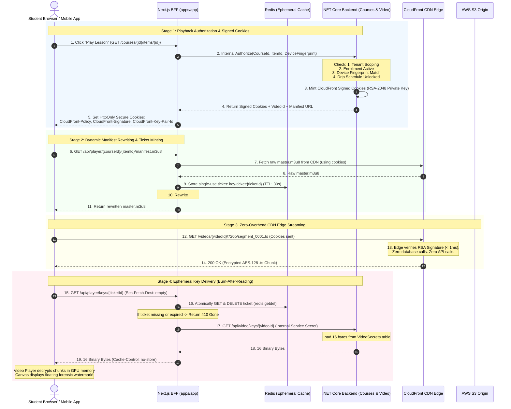

# 🛡️ AlphaZero Video Security: End-to-End Implementation Plan

## Goal Description
Build an enterprise-grade, defense-in-depth video security pipeline for **AlphaZero Learning Academy** that stops automated pirating tools (`yt-dlp`, browser scrapers, account sharing, and unauthorized CDN bandwidth egress) while remaining 100% compatible with low-bandwidth Syrian/MENA environments and avoiding expensive proprietary DRM licensing fees.

The solution integrates:
1. **At-Rest AES-128 Envelope Encryption** via AWS MediaConvert.
2. **Edge Gatekeeping** via AWS CloudFront RSA-2048 Signed Cookies.
3. **BFF Origin & Key Masking** via Next.js Dynamic Manifest Rewriting.
4. **Single-Use Ephemeral Key Tickets** (Burn-after-reading via Redis) killing `yt-dlp` and replay attacks.
5. **Context-Aware Device Enforcement** matching `LoggedInDeviceFingerprint == RequestDeviceFingerprint`.
6. **Dynamic Forensic Watermarking** overlaying authenticated student metadata over video playback.

---

## Architecture Overview



---

## User Review Required

> [!IMPORTANT]
> **1. CloudFront Key Pair vs Key Group Setup:**
> AWS CloudFront Signed Cookies require either an AWS Account Root Key Pair or a CloudFront Public Key Group. In modern AWS CDK, **Public Key Groups** are strongly recommended because they do not require AWS root account credentials and support automated key rotation.
> 
> **2. Single-Use Key Ticket Storage:**
> Ephemeral key tickets require an atomic cache store (`GETDEL`). In production, this runs on **Redis (ElastiCache / Dragonfly)**. If Redis is unavailable during local development, an in-memory sliding cache fallback is provided.

> [!WARNING]
> **3. yt-dlp & Offline Scraper Immunity:**
> With this plan, any attempt to pass the `.m3u8` link into `yt-dlp` fails because:
> - `yt-dlp` does not hold the student's HttpOnly session cookie.
> - The `#EXT-X-KEY` ticket expires within 30 seconds and is destroyed immediately upon first redemption (`GETDEL`).
> - The Next.js BFF rejects requests without browser `Sec-Fetch-Dest` and matching device fingerprints.

---

## Proposed Changes

### Component 1: .NET API Infrastructure & CloudFront Cookie Signer

#### [NEW] `src/alphazero-api/Shared/Security/ICloudFrontCookieSigner.cs`
Defines the interface for minting signed cookies using RSA private keys.

```csharp
namespace AlphaZero.Shared.Security;

public record CloudFrontCookies(
    string Policy,
    string Signature,
    string KeyPairId,
    string Domain,
    string Path,
    DateTimeOffset ExpiresAt);

public interface ICloudFrontCookieSigner
{
    CloudFrontCookies CreateSignedCookies(Guid videoId, TimeSpan lifetime);
}
```

#### [NEW] `src/alphazero-api/Shared/Infrastructure/Security/CloudFrontCookieSigner.cs`
Implements RSA-SHA1/SHA256 signature generation following AWS CloudFront specifications.

```csharp
using System.Security.Cryptography;
using System.Text;
using AlphaZero.Shared.Security;
using Microsoft.Extensions.Configuration;

namespace AlphaZero.Shared.Infrastructure.Security;

public class CloudFrontCookieSigner : ICloudFrontCookieSigner
{
    private readonly string _keyPairId;
    private readonly string _cdnDomain;
    private readonly RSA _rsa;

    public CloudFrontCookieSigner(IConfiguration config)
    {
        _keyPairId = config["CloudFront:KeyPairId"] ?? throw new ArgumentNullException("CloudFront:KeyPairId");
        _cdnDomain = config["CloudFront:Domain"] ?? "cdn.alphazero.academy";
        
        var pemContent = config["CloudFront:PrivateKeyPem"] 
            ?? (File.Exists(config["CloudFront:PrivateKeyPath"]) ? File.ReadAllText(config["CloudFront:PrivateKeyPath"]!) : null);
            
        if (string.IsNullOrEmpty(pemContent))
            throw new InvalidOperationException("CloudFront private key is not configured.");

        _rsa = RSA.Create();
        _rsa.ImportFromPem(pemContent);
    }

    public CloudFrontCookies CreateSignedCookies(Guid videoId, TimeSpan lifetime)
    {
        var expiresAt = DateTimeOffset.UtcNow.Add(lifetime);
        var resource = $"https://{_cdnDomain}/videos/{videoId}/*";
        var epochTime = expiresAt.ToUnixTimeSeconds();

        var policyJson = $"{{\"Statement\":[{{\"Resource\":\"{resource}\",\"Condition\":{{\"DateLessThan\":{{\"EpochTime\":{epochTime}}}}}}}]}}";
        var cleanPolicy = policyJson.Replace("\r", "").Replace("\n", "").Replace(" ", "");

        var policyBytes = Encoding.UTF8.GetBytes(cleanPolicy);
        var policyBase64 = ToUrlSafeBase64(policyBytes);

        var signatureBytes = _rsa.SignData(policyBytes, HashAlgorithmName.SHA1, RSASignaturePadding.Pkcs1);
        var signatureBase64 = ToUrlSafeBase64(signatureBytes);

        var cookieDomain = _cdnDomain.Contains('.') 
            ? _cdnDomain.Substring(_cdnDomain.IndexOf('.')) 
            : _cdnDomain;

        return new CloudFrontCookies(
            policyBase64,
            signatureBase64,
            _keyPairId,
            cookieDomain,
            $"/videos/{videoId}/",
            expiresAt);
    }

    private static string ToUrlSafeBase64(byte[] bytes) =>
        Convert.ToBase64String(bytes)
            .Replace('+', '-')
            .Replace('=', '_')
            .Replace('/', '~');
}
```

#### [NEW] `src/alphazero-api/Modules/Courses/Presentation/Features/GetPlaybackSession.cs`
Endpoint in Courses module validating enrollment, course publication status, device fingerprint, and issuing the signed ticket.

```csharp
using AlphaZero.Modules.Courses.Application.Courses.Queries.GetPlaybackSession;
using AlphaZero.Shared.Presentation.Extensions;
using FastEndpoints;
using Microsoft.AspNetCore.Http;

namespace AlphaZero.Modules.Courses.Presentation.Features;

public record GetPlaybackSessionRequest
{
    public Guid CourseId { get; init; }
    public Guid ItemId { get; init; }
}

public class GetPlaybackSessionEndpoint : Endpoint<GetPlaybackSessionRequest>
{
    private readonly ICoursesModule _module;

    public GetPlaybackSessionEndpoint(ICoursesModule module) => _module = module;

    public override void Configure()
    {
        Get("api/courses/{CourseId:guid}/items/{ItemId:guid}/playback-session");
        Description(d => d.WithTags("Course Streaming"));
    }

    public override async Task HandleAsync(GetPlaybackSessionRequest req, CancellationToken ct)
    {
        var deviceFingerprint = HttpContext.Request.Headers["X-Device-Fingerprint"].ToString();
        var query = new GetPlaybackSessionQuery(req.CourseId, req.ItemId, deviceFingerprint);
        var result = await _module.Send(query, ct);

        if (result.IsError)
        {
            await this.SendErrorResponseAsync(result.Errors, ct);
            return;
        }

        await SendOkAsync(result.Value, ct);
    }
}
```

---

### Component 2: Next.js BFF Shield & Dynamic Rewriter

#### [NEW] `src/alphazero-frontend/apps/app/app/api/player/[courseId]/[itemId]/manifest/route.ts`
Route handler fetching the `.m3u8` playlist, generating a 30-second single-use key ticket, and rewriting the `#EXT-X-KEY` header before serving.

```typescript
import { type NextRequest, NextResponse } from "next/server";
import { getSession } from "@/lib/auth";
import { redis } from "@/lib/redis";
import crypto from "crypto";

export async function GET(
  request: NextRequest,
  { params }: { params: Promise<{ courseId: string; itemId: string }> }
) {
  const { courseId, itemId } = await params;
  const session = await getSession(request);

  if (!session?.user) {
    return new NextResponse("Unauthorized", { status: 401 });
  }

  const deviceFingerprint = request.headers.get("x-device-fingerprint") || "";

  // 1. Request playback session from .NET Core
  const sessionRes = await fetch(
    `${process.env.INTERNAL_DOTNET_API_URL}/api/courses/${courseId}/items/${itemId}/playback-session`,
    {
      headers: {
        "X-Tenant-Id": session.user.tenantId,
        "X-User-Id": session.user.id,
        "X-Device-Fingerprint": deviceFingerprint,
      },
    }
  );

  if (!sessionRes.ok) {
    return new NextResponse("Forbidden", { status: sessionRes.status });
  }

  const playback = await sessionRes.json();
  const { videoId, manifestUrl, cookies } = playback;

  // 2. Fetch raw manifest from CloudFront using signed cookies
  const cfCookies = `CloudFront-Policy=${cookies.policy}; CloudFront-Signature=${cookies.signature}; CloudFront-Key-Pair-Id=${cookies.keyPairId}`;
  const manifestRes = await fetch(manifestUrl, {
    headers: { Cookie: cfCookies },
  });

  if (!manifestRes.ok) {
    return new NextResponse("Failed to load upstream manifest", { status: 502 });
  }

  let manifestText = await manifestRes.text();

  // 3. Generate 30-second single-use ticket
  const ticketId = crypto.randomBytes(16).toString("hex");
  const ticketPayload = JSON.stringify({
    videoId,
    userId: session.user.id,
    deviceFingerprint,
    createdAt: Date.now(),
  });

  await redis.set(`key-ticket:${ticketId}`, ticketPayload, "EX", 30);

  // 4. Rewrite #EXT-X-KEY line to proxy through Next.js
  const keyProxyUrl = `/api/player/keys/${ticketId}`;
  manifestText = manifestText.replace(
    /#EXT-X-KEY:METHOD=AES-128,URI="[^"]+"/g,
    `#EXT-X-KEY:METHOD=AES-128,URI="${keyProxyUrl}"`
  );

  const response = new NextResponse(manifestText, {
    headers: {
      "Content-Type": "application/vnd.apple.mpegurl",
      "Cache-Control": "no-store, no-cache, must-revalidate",
    },
  });

  // Attach CloudFront cookies to client domain
  response.cookies.set("CloudFront-Policy", cookies.policy, {
    domain: cookies.domain,
    path: `/videos/${videoId}/`,
    secure: true,
    httpOnly: true,
    sameSite: "none",
  });
  response.cookies.set("CloudFront-Signature", cookies.signature, {
    domain: cookies.domain,
    path: `/videos/${videoId}/`,
    secure: true,
    httpOnly: true,
    sameSite: "none",
  });
  response.cookies.set("CloudFront-Key-Pair-Id", cookies.keyPairId, {
    domain: cookies.domain,
    path: `/videos/${videoId}/`,
    secure: true,
    httpOnly: true,
    sameSite: "none",
  });

  return response;
}
```

#### [NEW] `src/alphazero-frontend/apps/app/app/api/player/keys/[ticket]/route.ts`
Burn-after-reading key endpoint. Consumes ticket atomically and retrieves the 16 bytes.

```typescript
import { type NextRequest, NextResponse } from "next/server";
import { getSession } from "@/lib/auth";
import { redis } from "@/lib/redis";

export async function GET(
  request: NextRequest,
  { params }: { params: Promise<{ ticket: string }> }
) {
  const { ticket } = await params;
  const session = await getSession(request);

  if (!session?.user) {
    return new NextResponse("Unauthorized", { status: 401 });
  }

  // 1. Anti-curl / Anti-yt-dlp: Verify browser fetch context
  const secFetchDest = request.headers.get("sec-fetch-dest");
  if (secFetchDest && secFetchDest !== "empty") {
    return new NextResponse("Forbidden: Invalid Fetch Destination", { status: 403 });
  }

  // 2. Burn-after-reading: Atomically retrieve and delete ticket
  const ticketData = await redis.getdel(`key-ticket:${ticket}`);
  if (!ticketData) {
    return new NextResponse("Expired or Already Redeemed Key Ticket", { status: 410 });
  }

  const { videoId, userId, deviceFingerprint } = JSON.parse(ticketData);

  // 3. Verify user and device integrity
  if (userId !== session.user.id) {
    return new NextResponse("Session Mismatch", { status: 403 });
  }

  const clientFingerprint = request.headers.get("x-device-fingerprint") || "";
  if (deviceFingerprint && clientFingerprint !== deviceFingerprint) {
    return new NextResponse("Device Mismatch", { status: 403 });
  }

  // 4. Server-to-server call to .NET API
  const backendRes = await fetch(
    `${process.env.INTERNAL_DOTNET_API_URL}/api/video/keys/${videoId}`,
    {
      headers: {
        "X-Internal-Service-Key": process.env.INTERNAL_API_SECRET!,
        "X-Tenant-Id": session.user.tenantId,
        "X-User-Id": session.user.id,
      },
    }
  );

  if (!backendRes.ok) {
    return new NextResponse("Key Not Found", { status: backendRes.status });
  }

  const keyBytes = await backendRes.arrayBuffer();

  return new NextResponse(keyBytes, {
    headers: {
      "Content-Type": "application/octet-stream",
      "Cache-Control": "no-store, no-cache, must-revalidate, private",
      "Pragma": "no-cache",
    },
  });
}
```

---

### Component 3: Client Video Player & Forensic Watermark

#### [NEW] `src/alphazero-frontend/packages/design-system/components/video-player/forensic-watermark.tsx`
Renders an animated HTML5 `<canvas>` floating across the video container with the student's name, masked phone number, and IP timestamp.

```typescript
"use client";

import { useEffect, useRef } from "react";

interface ForensicWatermarkProps {
  studentName: string;
  phone: string;
  userId: string;
}

export function ForensicWatermark({ studentName, phone, userId }: ForensicWatermarkProps) {
  const canvasRef = useRef<HTMLCanvasElement | null>(null);

  useEffect(() => {
    const canvas = canvasRef.current;
    if (!canvas) return;
    const ctx = canvas.getContext("2d");
    if (!ctx) return;

    let posX = 20;
    let posY = 40;
    let speedX = 0.5;
    let speedY = 0.3;
    let animId: number;

    const watermarkText = `${studentName} • ${phone} • ID: ${userId.slice(0, 8)}`;

    const render = () => {
      ctx.clearRect(0, 0, canvas.width, canvas.height);
      ctx.font = "12px sans-serif";
      ctx.fillStyle = "rgba(255, 255, 255, 0.28)";
      ctx.shadowColor = "rgba(0, 0, 0, 0.6)";
      ctx.shadowBlur = 4;
      ctx.fillText(watermarkText, posX, posY);

      posX += speedX;
      posY += speedY;

      if (posX < 10 || posX > canvas.width - 220) speedX *= -1;
      if (posY < 20 || posY > canvas.height - 20) speedY *= -1;

      animId = requestAnimationFrame(render);
    };

    render();
    return () => cancelAnimationFrame(animId);
  }, [studentName, phone, userId]);

  return (
    <canvas
      ref={canvasRef}
      width={640}
      height={360}
      className="pointer-events-none absolute inset-0 z-20 h-full w-full select-none"
    />
  );
}
```

---

## Verification Plan

### Automated Tests
1. **CloudFront Signer Unit Tests:**
   Verify RSA-SHA1/SHA256 signature generation against AWS test vectors:
   ```bash
   dotnet test --filter "FullyQualifiedName~CloudFrontCookieSignerTests"
   ```
2. **Playback Session Authorization Tests:**
   Verify that non-enrolled students or mismatched device fingerprints receive `403 Forbidden`:
   ```bash
   dotnet test --filter "FullyQualifiedName~GetPlaybackSessionEndpointTests"
   ```
3. **Next.js BFF Route Tests:**
   Verify single-use burn-after-reading in Vitest:
   - First request to `/api/player/keys/{ticket}` $\rightarrow$ 200 OK.
   - Second request to same ticket $\rightarrow$ 410 Gone.
   ```bash
   pnpm test:unit
   ```

### Manual Verification
1. **yt-dlp Attack Simulation:**
   Run `yt-dlp <manifestUrl>` in terminal without cookies. Verify download is rejected by CloudFront (`403 Forbidden`).
2. **Replay Attack Simulation:**
   Copy the key proxy URL from Chrome DevTools Network tab and paste into Postman / curl. Verify it returns `410 Gone` because the ticket was consumed on playback.
3. **Forensic Watermark Inspection:**
   Verify watermark floats smoothly across the player and remains visible when pausing or fullscreening.
